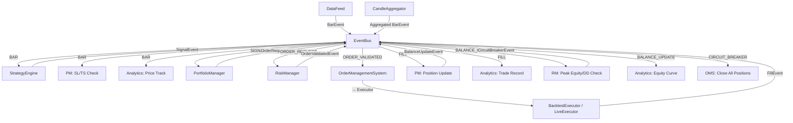

# EDA 이벤트 체인 다이어그램

## 전체 흐름 (Mermaid)



---

## 이벤트 타입 상세

### BarEvent (DROPPABLE)

```
발행: DataFeed / CandleAggregator
구독: StrategyEngine, PM, Analytics
용도: 시장 데이터 업데이트

필드:
- symbol: str
- timeframe: str ("1D", "4h", "1m")
- open, high, low, close, volume: float
- timestamp: datetime
```

**1m Aggregation Mode:**
- 1m BarEvent → CandleAggregator가 수집
- Target TF 완성 시 → Aggregated BarEvent 발행
- PM은 1m BarEvent에서 SL/TS만 체크 (`_on_intrabar()`)
- StrategyEngine은 target TF BarEvent만 처리 (`target_timeframe` 필터)

### SignalEvent (기본)

```
발행: StrategyEngine
구독: PM
용도: 전략의 매매 시그널

필드:
- symbol: str
- direction: int (-1, 0, 1)
- strength: float (0.0 ~ 1.0+)
- strategy_name: str
- correlation_id: str
```

### OrderRequestEvent (NEVER_DROP)

```
발행: PM
구독: RM
용도: 주문 요청 (pre-validation)

필드:
- symbol: str
- side: str ("buy" / "sell")
- order_type: str ("market")
- quantity: float
- client_order_id: str (멱등성)
- correlation_id: str
```

### OrderValidatedEvent (NEVER_DROP)

```
발행: RM
구독: OMS
용도: 리스크 검증 통과한 주문

필드: OrderRequestEvent + validation_status
```

### FillEvent (NEVER_DROP)

```
발행: Executor (via OMS)
구독: PM, Analytics
용도: 주문 체결 결과

필드:
- symbol: str
- side: str
- quantity: float
- fill_price: float
- fee: float
- client_order_id: str
- correlation_id: str
```

### BalanceUpdateEvent (NEVER_DROP)

```
발행: PM
구독: RM, Analytics
용도: 잔고 변동 (체결 후)

필드:
- cash: float
- total_equity: float
- timestamp: datetime
- correlation_id: str
```

### CircuitBreakerEvent (NEVER_DROP)

```
발행: RM
구독: OMS
용도: 시스템 긴급 정지 (MDD 초과)

필드:
- reason: str
- drawdown_pct: float
- timestamp: datetime
```

---

## 이벤트 처리 순서

### 단일 Bar 사이클

```
1. DataFeed → BarEvent 발행
2. await bus.flush()
   2a. StrategyEngine._on_bar() → SignalEvent 발행
   2b. PM._on_bar() → SL/TS 체크 → (OrderRequestEvent)
   2c. Analytics._on_bar() → 가격 기록
3. flush 계속
   3a. PM._on_signal() → OrderRequestEvent 발행
   3b. RM._on_order_request() → OrderValidatedEvent 발행
   3c. OMS._on_order_validated() → Executor → FillEvent 발행
   3d. PM._on_fill() → Position 업데이트 → BalanceUpdateEvent 발행
   3e. RM._on_balance_update() → DD 체크 → (CircuitBreakerEvent)
   3f. Analytics._on_fill(), _on_balance_update() → 기록
4. flush 완료 → 다음 bar
```

### Batch Mode (멀티에셋)

```
1. DataFeed → BarEvent (asset 1) 발행 + flush
   → Strategy → Signal 수집 (즉시 주문 안 함)
2. DataFeed → BarEvent (asset 2) 발행 + flush
   → Strategy → Signal 수집
...
N. 모든 asset bar 처리 완료
N+1. Runner → pm.flush_pending_signals()
   → 동일 equity snapshot으로 일괄 OrderRequestEvent 발행
   → RM → OMS → Fill (순차)
```
