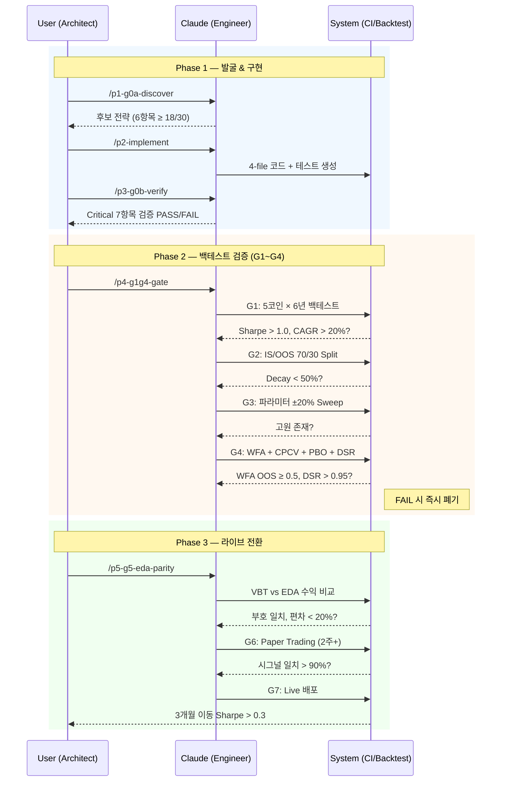

# MC Coin Bot

Event-Driven Architecture 기반 암호화폐 퀀트 트레이딩 시스템.

50개 전략을 8단계 Gate 파이프라인으로 평가하여 실전 운용 후보를 선별합니다.
현재 **2개 전략 G5 PASS** (CTREND, Anchor-Mom) — Paper Trading(G6) 대기 중.

---

## 아키텍처

```
WebSocket → MarketData → Strategy → Signal → PM → RM → OMS → Fill
```

### 핵심 설계 원칙

- **Stateless Strategy / Stateful Execution** -- 전략은 시그널만 생성, PM/RM/OMS가 포지션 관리
- **Target Weights 기반** -- "사라/팔아라" 대신 "적정 비중은 X%"
- **Look-Ahead Bias 원천 차단** -- Signal at Close → Execute at Next Open
- **PM/RM 분리 모델** -- Portfolio Manager → Risk Manager → OMS 3단계 방어

### 기술 스택

| 구분 | 기술 |
|------|------|
| Language | Python 3.13 |
| Package Manager | uv |
| Type Safety | Pydantic V2 + pyright |
| Exchange | CCXT Pro (WebSocket + REST) |
| Backtesting | VectorBT + Numba |
| EDA Backtesting | EventBus + CandleAggregator |
| Data | Parquet (Medallion Architecture) |
| Monitoring | Prometheus + Grafana |
| Notification | Discord.py (Bot + Slash Commands) |
| Charts | matplotlib (Agg headless) |
| Logging | Loguru |
| CI/CD | GitHub Actions + Coolify |

---

## 전략 설정 (Config YAML)

모든 백테스트와 실행은 YAML 설정 파일 하나로 제어됩니다.
VBT 백테스트와 EDA 백테스트에서 동일한 설정을 공유합니다.

### 설정 구조

```yaml
# config/my_strategy.yaml
backtest:
  symbols: [BTC/USDT, ETH/USDT]   # 1개: 단일에셋, 2개+: 멀티에셋 (Equal Weight)
  timeframe: "1D"                   # 1D, 4h, 1h 등
  start: "2020-01-01"
  end: "2025-12-31"
  capital: 100000.0

strategy:
  name: tsmom                       # 등록된 전략 이름 (strategies 명령으로 확인)
  params:                           # 전략별 파라미터 (각 전략의 config.py 참조)
    lookback: 30
    vol_window: 30
    vol_target: 0.35
    short_mode: 1                   # 0=DISABLED, 1=HEDGE_ONLY, 2=FULL
    hedge_threshold: -0.07
    hedge_strength_ratio: 0.3

portfolio:
  max_leverage_cap: 2.0
  rebalance_threshold: 0.10         # 비중 변화 10% 이상 시 리밸런싱
  system_stop_loss: 0.10            # 10% 시스템 손절 (안전망)
  use_trailing_stop: true
  trailing_stop_atr_multiplier: 3.0 # 3x ATR 트레일링 스톱
  cost_model:                       # 선택 (기본값 있음)
    maker_fee: 0.0002
    taker_fee: 0.0004
    slippage: 0.0005
    funding_rate_8h: 0.0001
    market_impact: 0.0002
```

### 새 전략 설정 작성법

1. `config/` 디렉토리에 YAML 파일 생성
2. `strategy.name`에 등록된 전략 이름 지정 (`uv run python -m src.cli.backtest strategies`로 확인)
3. `strategy.params`에 해당 전략의 파라미터 입력 (각 전략의 `src/strategy/<name>/config.py` 참조)
4. `backtest.symbols`에 테스트할 심볼 나열 (2개 이상이면 자동으로 Equal Weight 멀티에셋)

---

## 전략 파이프라인

전략은 **아이디어 발굴(G0A)** → **실전 배포(G7)** 까지 8단계 Gate를 순차 통과해야 합니다.
각 Gate에서 FAIL 시 즉시 폐기. 50개 전략 중 **2개 G5 PASS** (CTREND, Anchor-Mom).



Gate별 상세 기준은 [전략 평가 표준](docs/strategy/evaluation-standard.md), 전체 현황은 [전략 상황판](docs/strategy/dashboard.md) 참조.

---

## 빠른 시작

### 환경 설정

```bash
uv sync --group dev --group research
cp .env.example .env  # API 키 설정
```

### 전략 목록 확인

```bash
# 등록된 전략 목록
uv run python -m src.cli.backtest strategies

# 전략 상세 정보
uv run python -m src.cli.backtest info
```

### VBT 백테스트

```bash
# 단일에셋 백테스트
uv run python -m src.cli.backtest run config/default.yaml

# 멀티에셋 포트폴리오 (config의 symbols 2개 이상)
uv run python -m src.cli.backtest run-multi config/default.yaml

# QuantStats HTML 리포트
uv run python -m src.cli.backtest run config/default.yaml --report

# Strategy Advisor 분석
uv run python -m src.cli.backtest run config/default.yaml --advisor

# Verbose 모드
uv run python -m src.cli.backtest run config/default.yaml -V
```

### EDA 백테스트

```bash
# EDA 백테스트 (1m 데이터 → target TF 집계, 단일/멀티 자동 판별)
uv run python main.py eda run config/default.yaml

# QuantStats 리포트 포함
uv run python main.py eda run config/default.yaml --report

# Shadow 모드 (시그널 로깅만, 체결 없음)
uv run python main.py eda run config/default.yaml --mode shadow
```

### Live Trading

```bash
# Paper 모드 — WebSocket 실시간 데이터 + 시뮬레이션 체결
uv run python main.py eda run-live config/paper.yaml --mode paper

# Shadow 모드 — 시그널 로깅만, 체결 없음
uv run python main.py eda run-live config/paper.yaml --mode shadow

# Live 모드 — Binance USDT-M Futures 실주문 (Hedge Mode)
# ⚠️ 실자금 거래! 확인 프롬프트가 표시됩니다.
uv run python main.py eda run-live config/paper.yaml --mode live
```

Live 모드는 Binance USDT-M Futures에서 Hedge Mode(Cross Margin, 1x Leverage)로 실행됩니다.
60초마다 거래소 포지션과 PM 상태를 교차 검증(PositionReconciler)하며, 불일치 시 경고만 발행합니다(자동 수정 없음).

### 과적합 검증

```bash
# QUICK: IS/OOS Split
uv run python -m src.cli.backtest validate -m quick

# MILESTONE: Walk-Forward (5-fold)
uv run python -m src.cli.backtest validate -m milestone

# FINAL: CPCV + DSR + PBO
uv run python -m src.cli.backtest validate -m final

# 특정 심볼/전략 지정
uv run python -m src.cli.backtest validate -m quick -s tsmom --symbols BTC/USDT,ETH/USDT
```

### 시그널 진단

```bash
# TSMOM 시그널 파이프라인 분석
uv run python -m src.cli.backtest diagnose BTC/USDT -s tsmom

# Adaptive Breakout 진단
uv run python -m src.cli.backtest diagnose SOL/USDT -s adaptive-breakout -V
```

### 데이터 수집

```bash
# Bronze → Silver 파이프라인
uv run python main.py ingest pipeline BTC/USDT --year 2024 --year 2025

# 데이터 검증
uv run python main.py ingest validate data/silver/BTC_USDT_1m_2025.parquet

# 상위 N개 심볼 일괄 다운로드
uv run python main.py ingest bulk-download --top 100 --year 2024 --year 2025

# 데이터 상태 확인
uv run python main.py ingest info
```

### 일괄 백테스트 & 스코어카드

```bash
# 전 전략 일괄 백테스트 (50 전략 x 5 자산)
uv run python scripts/bulk_backtest.py

# 스코어카드 자동 생성
uv run python scripts/generate_scorecards.py
```

### 배포 (Docker Compose + Coolify)

3개 서비스(트레이딩 봇, Prometheus, Grafana)를 `docker-compose.yml`로 한 번에 실행합니다.

#### 서비스 구성

| 서비스 | 이미지 | 포트 | 설명 |
|--------|--------|------|------|
| `mc-bot` | 로컬 빌드 | `8000` | 트레이딩 봇 + Prometheus metrics endpoint (`/metrics`) |
| `prometheus` | `prom/prometheus:v2.54.0` | `9090` | 메트릭 수집 + 저장 (10초 간격 스크래핑) |
| `grafana` | `grafana/grafana:11.4.0` | `3000` | 대시보드 시각화 (자동 프로비저닝) |

#### 실행

```bash
# 전체 스택 실행 (빌드 포함)
docker compose up --build -d

# 로그 확인
docker compose logs -f mc-bot

# 중지
docker compose down
```

#### 개별 Docker 실행 (모니터링 없이)

```bash
# Docker 빌드 (multi-stage, uv 기반)
docker build -t mc-coin-bot:latest .

# 단독 실행
docker run --env-file .env \
  -e MC_EXECUTION_MODE=paper \
  -e MC_CONFIG_PATH=config/paper.yaml \
  -e MC_INITIAL_CAPITAL=10000 \
  mc-coin-bot:latest
```

#### 환경 변수

DigitalOcean Droplet + Coolify로 배포합니다. `MC_*` 환경 변수로 실행 모드를 제어합니다.

| 환경 변수 | 기본값 | 설명 |
|----------|--------|------|
| `MC_EXECUTION_MODE` | `paper` | 실행 모드 (`paper` / `shadow` / `live`) |
| `MC_CONFIG_PATH` | `config/paper.yaml` | YAML 설정 파일 경로 |
| `MC_INITIAL_CAPITAL` | `10000` | 초기 자본 (USD) |
| `MC_DB_PATH` | `data/trading.db` | SQLite 경로 |
| `MC_ENABLE_PERSISTENCE` | `true` | 상태 영속화 on/off |
| `MC_METRICS_PORT` | `8000` | Prometheus metrics 포트 (`0`이면 비활성) |
| `GRAFANA_PASSWORD` | `admin` | Grafana 관리자 비밀번호 |

#### 모니터링

**Prometheus** (`http://localhost:9090`)
- `mcbot_equity_usdt` — 현재 자산 (USD)
- `mcbot_drawdown_pct` — 현재 drawdown (%)
- `mcbot_fills_total` — 체결 수 (symbol, side별)
- `mcbot_open_positions` — 오픈 포지션 수
- `mcbot_uptime_seconds` — 봇 가동 시간

**Grafana** (`http://localhost:3000`, 초기 비밀번호: `admin`)
- `monitoring/grafana/dashboards/trading.json`에 프로비저닝된 10-패널 대시보드 포함
- Equity curve, Drawdown gauge, Position sizes, Fills rate 등 실시간 모니터링
- Grafana Alert Rules로 Discord webhook 알림 설정 가능 (MDD > 15%, Bot down 등)

**Discord 알림**
- 체결, Circuit Breaker, 리스크 알림을 실시간으로 Discord 채널에 전송
- `/status`, `/kill`, `/balance` Slash Commands 지원
- Daily Report (매일 00:00 UTC): equity curve 차트 + 당일 요약
- Weekly Report (매주 월요일 00:00 UTC): drawdown, 월간 히트맵, PnL 분포 차트 포함

---

## 전략 현황

| 전략 | Best Asset | TF | Sharpe | CAGR | 상태 |
|------|-----------|-----|--------|------|------|
| **CTREND** | SOL/USDT | 1D | 2.05 | +97.8% | G5 PASS |
| **Anchor-Mom** | DOGE/USDT | 12H | 1.36 | +49.8% | G5 PASS |

> 50개 전략 중 2개 활성 + 48개 폐기.
> 상세 현황은 **[전략 상황판](docs/strategy/dashboard.md)** 참조 (`uv run python main.py pipeline report`로 자동 생성).

전략 메타데이터는 `strategies/*.yaml`에서 YAML로 관리됩니다.

```bash
uv run python main.py pipeline status   # 현황 요약
uv run python main.py pipeline table    # 전체 Gate 진행도
uv run python main.py pipeline show ctrend  # 전략 상세
uv run python main.py pipeline report   # Dashboard 재생성
```

### 교훈 관리 (Lessons)

50개 전략 평가 과정에서 축적된 22개 핵심 교훈을 `lessons/*.yaml`로 구조화 관리합니다.
카테고리(6종), 태그, 전략, TF별 프로그래매틱 검색이 가능합니다.

```bash
uv run python main.py pipeline lessons-list              # 전체 교훈 목록
uv run python main.py pipeline lessons-list -c strategy-design  # 카테고리 필터
uv run python main.py pipeline lessons-list -t ML         # 태그 필터
uv run python main.py pipeline lessons-list -s ctrend     # 관련 전략 필터
uv run python main.py pipeline lessons-list --tf 1H       # TF 필터
uv run python main.py pipeline lessons-show 1             # 교훈 상세
uv run python main.py pipeline lessons-add \
  --title "제목" --body "설명" -c strategy-design -t tag1 -t tag2
```

카테고리: `strategy-design`, `risk-management`, `market-structure`, `data-resolution`, `pipeline-process`, `meta-analysis`
