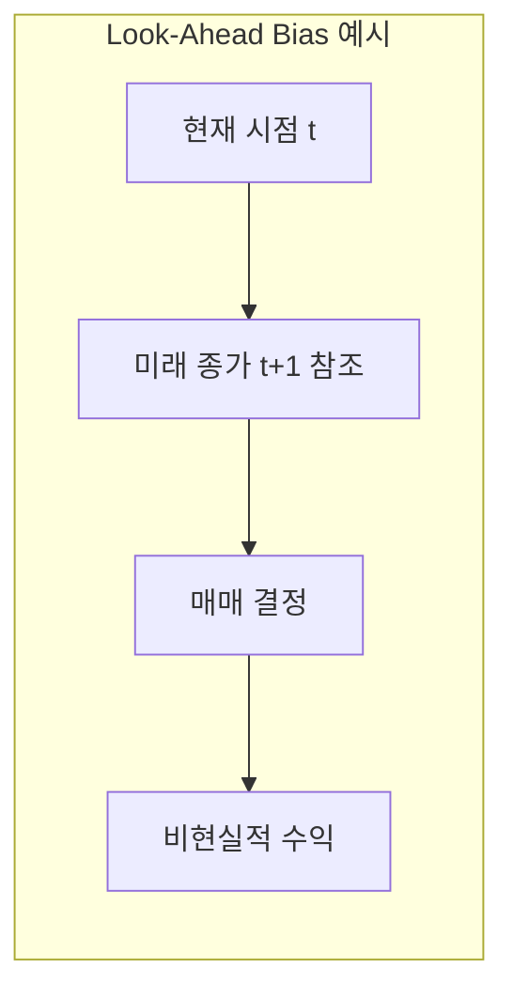
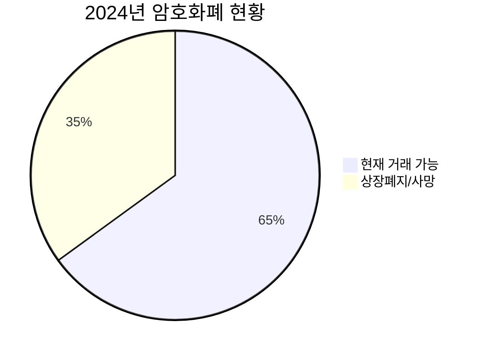
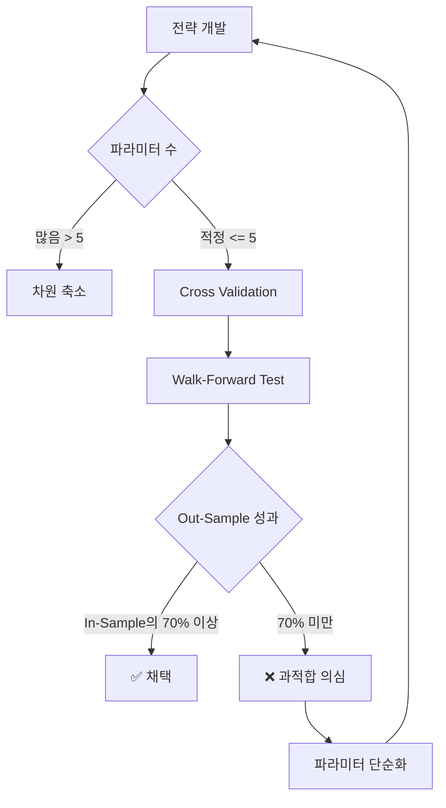
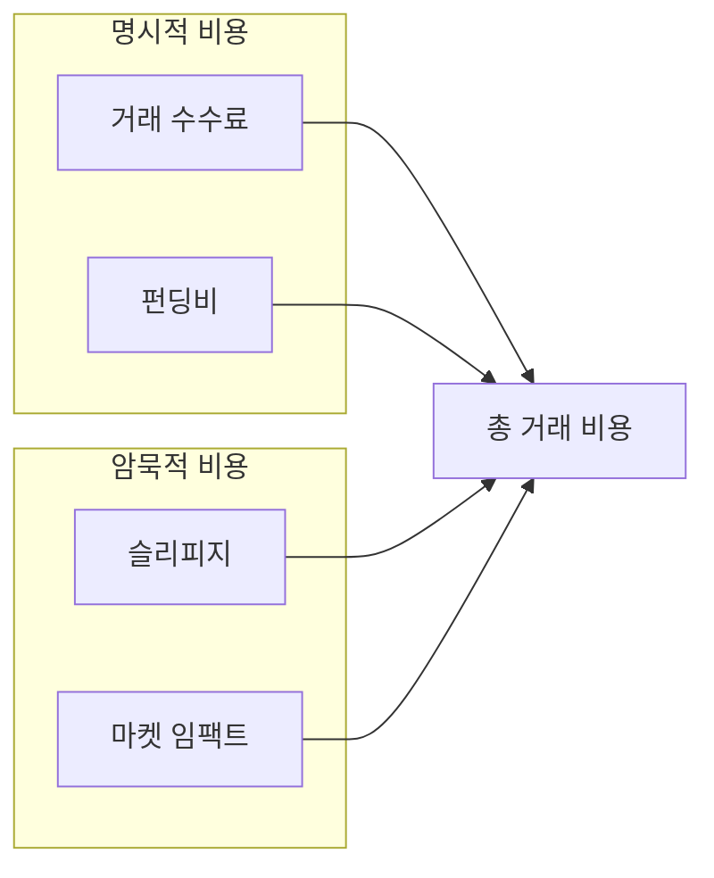
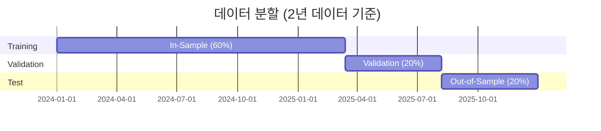
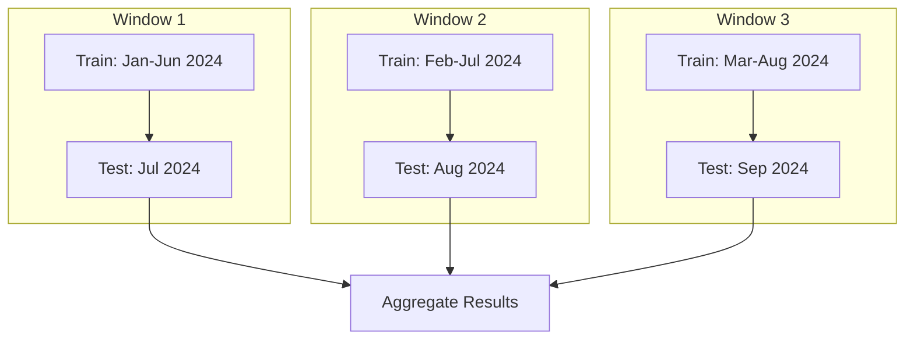

# 🎯 백테스팅 모범사례 가이드

> [!WARNING]
> **"백테스트에서 성공한 전략의 대부분은 실전에서 실패합니다."**
> 
> Duke University 연구에 따르면, 백테스트 오류(Look-ahead bias, Overfitting 등)가
> 라이브 트레이딩 실패의 주요 원인입니다. 이 문서의 가이드라인을 반드시 준수하세요.

---

## 📋 목차

1. [핵심 함정과 해결책](#1-핵심-함정과-해결책)
2. [데이터 품질 관리](#2-데이터-품질-관리)
3. [현실적 비용 모델링](#3-현실적-비용-모델링)
4. [검증 방법론](#4-검증-방법론)
5. [구현 체크리스트](#5-구현-체크리스트)
6. [코드 패턴 가이드](#6-코드-패턴-가이드)

---

## 1. 핵심 함정과 해결책

### 1.1 Look-Ahead Bias (미래 정보 참조 오류)

> **정의:** 실제 트레이딩 시점에서는 알 수 없었던 미래 정보를 사용하는 오류

#### 🔴 발생 원인



| 유형 | 설명 | 예시 |
|------|------|------|
| **코드 오류** | 인덱싱 실수로 미래 데이터 참조 | `df['close'].shift(-1)` 사용 |
| **데이터 타이밍** | 지표 계산 시점 오류 | RSI를 종가 확정 전 계산 |
| **정보 지연 무시** | 공시/뉴스 반영 시간 무시 | 발표 즉시 매매 가정 |

#### ✅ 해결책

```python
# ❌ BAD: 미래 데이터 참조
def bad_signal(df: pd.DataFrame) -> pd.Series:
    # shift(-1)은 미래 데이터를 현재로 당김
    future_return = df["close"].shift(-1) / df["close"] - 1
    return future_return > 0.01  # 미래 수익률로 현재 결정

# ✅ GOOD: 과거 데이터만 사용
def good_signal(df: pd.DataFrame) -> pd.Series:
    # shift(1)은 과거 데이터를 현재로 가져옴
    past_return = df["close"] / df["close"].shift(1) - 1
    momentum = past_return.rolling(24).mean()  # 과거 24시간 평균
    return momentum > 0.001
```

**필수 검증:**
```python
def validate_no_lookahead(signal_series: pd.Series, price_series: pd.Series) -> bool:
    """시그널이 미래 가격과 상관관계가 있으면 Look-ahead bias 의심."""
    future_returns = price_series.shift(-1) / price_series - 1
    correlation = signal_series.corr(future_returns)
    
    # 상관계수가 비정상적으로 높으면 의심
    if abs(correlation) > 0.3:
        raise ValueError(f"Potential look-ahead bias detected: corr={correlation:.3f}")
    return True
```

---

### 1.2 Survivorship Bias (생존자 편향)

> **정의:** 현재 존재하는 종목만으로 백테스트하여 상폐/실패 종목을 제외하는 오류

#### 🔴 문제점



| 영향 | 설명 |
|------|------|
| **수익률 과대평가** | 실패한 코인의 손실이 제외됨 |
| **위험 과소평가** | 파산/상폐 위험이 반영 안 됨 |
| **전략 왜곡** | 실제로는 상폐 코인에 투자했을 수 있음 |

#### ✅ 해결책

```python
# 1. 생존자 편향 없는 유니버스 구성
def get_historical_universe(date: datetime) -> list[str]:
    """해당 시점에 거래 가능했던 모든 종목 반환 (상폐 포함)."""
    query = """
        SELECT DISTINCT symbol 
        FROM historical_listings
        WHERE listing_date <= :date
        AND (delisting_date IS NULL OR delisting_date > :date)
    """
    return db.execute(query, {"date": date}).fetchall()

# 2. 상폐 종목 처리
def handle_delisting(position: Position, delisting_price: Decimal) -> Trade:
    """상폐 시 강제 청산 처리."""
    return Trade(
        symbol=position.symbol,
        side="SELL",
        quantity=position.quantity,
        price=delisting_price * Decimal("0.5"),  # 상폐 시 50% 손실 가정
        reason="DELISTING",
    )
```

**데이터 요구사항:**
- [ ] 상장/상폐 이력 데이터 확보
- [ ] 상폐 종목의 마지막 가격 데이터 보존
- [ ] 유의종목 지정 이력 데이터

---

### 1.3 Overfitting (과적합)

> **정의:** 과거 데이터에만 최적화되어 미래에는 작동하지 않는 전략

#### 🔴 과적합 징후

| 징후 | 설명 |
|------|------|
| **파라미터가 너무 많음** | 데이터 포인트 대비 파라미터 과다 |
| **In-Sample 성과만 좋음** | Out-of-Sample에서 급격히 하락 |
| **특정 기간에만 작동** | 2024년에만 좋고 2023년은 나쁨 |
| **논리적 설명 불가** | 왜 작동하는지 설명 못함 |

#### 📊 과적합 탐지 지표

```python
def calculate_overfitting_probability(
    in_sample_sharpe: float,
    out_sample_sharpe: float,
    num_parameters: int,
    num_trials: int,
) -> float:
    """
    과적합 확률 추정 (Probability of Backtest Overfitting, PBO).
    
    Bailey et al. (2014) 방법론 기반.
    """
    # 성과 하락률
    performance_degradation = 1 - (out_sample_sharpe / in_sample_sharpe)
    
    # 파라미터 페널티
    param_penalty = num_parameters / num_trials
    
    # 과적합 확률 (단순화된 휴리스틱)
    pbo = min(1.0, performance_degradation + param_penalty)
    
    return pbo
```

#### ✅ 과적합 방지 전략



**권장 파라미터 수:**
```
최대 파라미터 수 = sqrt(데이터 포인트 수) / 10

예시: 2년 1시간봉 = 17,520개 데이터
     sqrt(17,520) / 10 ≈ 13개 파라미터 이하
```

---

### 1.4 Data Snooping (데이터 염탐)

> **정의:** 동일한 데이터로 여러 전략을 테스트하여 우연히 좋은 결과를 찾는 오류

#### 🔴 문제점

```
100개 전략 테스트 → 5개가 유의미 (p < 0.05)
→ 실제로는 우연의 결과 (다중 검정 문제)
```

#### ✅ 해결책: Bonferroni 보정

```python
def apply_multiple_testing_correction(
    p_values: list[float],
    num_tests: int,
    method: str = "bonferroni",
) -> list[bool]:
    """다중 검정 보정."""
    if method == "bonferroni":
        # Bonferroni: 유의수준을 테스트 횟수로 나눔
        adjusted_alpha = 0.05 / num_tests
        return [p < adjusted_alpha for p in p_values]
    elif method == "holm":
        # Holm-Bonferroni: 단계적 보정
        sorted_indices = sorted(range(len(p_values)), key=lambda i: p_values[i])
        significant = [False] * len(p_values)
        for rank, idx in enumerate(sorted_indices):
            adjusted_alpha = 0.05 / (num_tests - rank)
            if p_values[idx] < adjusted_alpha:
                significant[idx] = True
            else:
                break
        return significant
    else:
        raise ValueError(f"Unknown method: {method}")
```

**필수 기록:**
- [ ] 테스트한 모든 전략 버전 기록
- [ ] 각 전략의 p-value 및 효과 크기 기록
- [ ] 최종 선택 전략의 선택 이유 문서화

---

## 2. 데이터 품질 관리

### 2.1 데이터 검증 체크리스트

| 항목 | 검증 방법 | 임계값 |
|------|----------|--------|
| **결측치** | `df.isnull().sum()` | < 0.1% |
| **중복 타임스탬프** | `df.index.duplicated()` | 0개 |
| **시간 연속성** | 간격 일정성 확인 | 모든 간격 동일 |
| **가격 이상치** | Z-score > 5 탐지 | 수동 검토 |
| **OHLC 일관성** | High >= Low, High >= Open/Close | 100% 통과 |

### 2.2 데이터 검증 코드

```python
from dataclasses import dataclass
from loguru import logger

@dataclass
class DataQualityReport:
    """데이터 품질 검사 결과."""
    missing_ratio: float
    duplicate_count: int
    gap_count: int
    outlier_count: int
    ohlc_violations: int
    is_valid: bool


def validate_ohlcv_data(df: pd.DataFrame) -> DataQualityReport:
    """OHLCV 데이터 품질 검증."""
    # 1. 결측치 비율
    missing_ratio = df.isnull().sum().sum() / (len(df) * len(df.columns))
    
    # 2. 중복 타임스탬프
    duplicate_count = df.index.duplicated().sum()
    
    # 3. 시간 간격 검사
    time_diffs = df.index.to_series().diff()
    expected_gap = time_diffs.mode()[0]
    gap_count = (time_diffs != expected_gap).sum() - 1  # 첫 번째 NaN 제외
    
    # 4. 이상치 탐지 (종가 기준 Z-score)
    z_scores = (df["close"] - df["close"].mean()) / df["close"].std()
    outlier_count = (abs(z_scores) > 5).sum()
    
    # 5. OHLC 일관성
    ohlc_violations = (
        (df["high"] < df["low"]).sum() +
        (df["high"] < df["open"]).sum() +
        (df["high"] < df["close"]).sum() +
        (df["low"] > df["open"]).sum() +
        (df["low"] > df["close"]).sum()
    )
    
    # 종합 판정
    is_valid = (
        missing_ratio < 0.001 and
        duplicate_count == 0 and
        gap_count < len(df) * 0.01 and
        ohlc_violations == 0
    )
    
    report = DataQualityReport(
        missing_ratio=missing_ratio,
        duplicate_count=duplicate_count,
        gap_count=gap_count,
        outlier_count=outlier_count,
        ohlc_violations=ohlc_violations,
        is_valid=is_valid,
    )
    
    if not is_valid:
        logger.warning(f"Data quality check failed: {report}")
    
    return report
```

### 2.3 결측치 처리 전략

| 결측치 유형 | 처리 방법 | 코드 |
|------------|----------|------|
| **단일 캔들** | Forward Fill | `df.ffill()` |
| **연속 < 5개** | 선형 보간 | `df.interpolate()` |
| **연속 >= 5개** | 해당 구간 제외 | 별도 처리 |

```python
def handle_missing_data(df: pd.DataFrame, max_consecutive: int = 5) -> pd.DataFrame:
    """결측치 처리 (연속 결측 한도 적용)."""
    # 연속 결측 구간 탐지
    is_null = df["close"].isnull()
    consecutive_nulls = is_null.groupby((~is_null).cumsum()).cumsum()
    
    # 한도 초과 구간 마킹
    excessive_gaps = consecutive_nulls > max_consecutive
    
    if excessive_gaps.any():
        logger.warning(f"Found {excessive_gaps.sum()} points with excessive gaps")
        # 해당 구간 시작/끝 로깅
        gap_starts = excessive_gaps & ~excessive_gaps.shift(1, fill_value=False)
        for ts in df.index[gap_starts]:
            logger.warning(f"Gap starts at: {ts}")
    
    # 허용 범위 내 결측은 보간
    df_filled = df.interpolate(method="linear", limit=max_consecutive)
    
    return df_filled
```

---

## 3. 현실적 비용 모델링

### 3.1 거래 비용 구성 요소



### 3.2 비용 파라미터

| 비용 항목 | 보수적 가정 | 낙관적 가정 | 현실적 가정 |
|----------|------------|------------|------------|
| **Maker Fee** | 0.02% | 0.01% | 0.02% |
| **Taker Fee** | 0.05% | 0.03% | 0.04% |
| **Slippage** | 0.10% | 0.03% | 0.05% |
| **Market Impact** | 0.05% | 0.01% | 0.02% |
| **Funding (8h)** | 0.03% | 0.005% | 0.01% |

> [!TIP]
> **권장:** 초기 백테스트는 **보수적 가정**으로 시작하고,
> 실거래 데이터 축적 후 파라미터를 조정하세요.

### 3.3 비용 모델 구현

```python
from decimal import Decimal
from pydantic import BaseModel

class CostModelConfig(BaseModel):
    """거래 비용 모델 설정."""
    maker_fee: Decimal = Decimal("0.0002")      # 0.02%
    taker_fee: Decimal = Decimal("0.0004")      # 0.04%
    slippage_rate: Decimal = Decimal("0.0005")  # 0.05%
    market_impact_rate: Decimal = Decimal("0.0002")  # 0.02%
    funding_rate_8h: Decimal = Decimal("0.0001")     # 0.01%


class CostModel:
    """현실적 거래 비용 계산."""
    
    def __init__(self, config: CostModelConfig) -> None:
        self._config = config
    
    def calculate_entry_cost(
        self,
        notional_value: Decimal,
        is_maker: bool = False,
    ) -> Decimal:
        """진입 시 비용 계산."""
        fee = self._config.maker_fee if is_maker else self._config.taker_fee
        slippage = self._config.slippage_rate
        
        total_rate = fee + slippage
        return notional_value * total_rate
    
    def calculate_exit_cost(
        self,
        notional_value: Decimal,
        is_maker: bool = False,
    ) -> Decimal:
        """청산 시 비용 계산."""
        # 진입과 동일한 로직
        return self.calculate_entry_cost(notional_value, is_maker)
    
    def calculate_holding_cost(
        self,
        notional_value: Decimal,
        holding_hours: int,
        is_long: bool = True,
    ) -> Decimal:
        """보유 기간 비용 (펀딩비)."""
        funding_periods = holding_hours // 8
        
        # 롱 포지션: 양의 펀딩비 → 비용 발생
        # 숏 포지션: 양의 펀딩비 → 수익 발생 (음수 비용)
        direction = 1 if is_long else -1
        
        return notional_value * self._config.funding_rate_8h * funding_periods * direction
    
    def calculate_round_trip_cost(
        self,
        notional_value: Decimal,
        holding_hours: int = 0,
        is_long: bool = True,
    ) -> Decimal:
        """왕복 거래 총 비용."""
        entry_cost = self.calculate_entry_cost(notional_value)
        exit_cost = self.calculate_exit_cost(notional_value)
        holding_cost = self.calculate_holding_cost(notional_value, holding_hours, is_long)
        
        return entry_cost + exit_cost + holding_cost
```

### 3.4 슬리피지 동적 모델링

```python
def calculate_dynamic_slippage(
    order_size_usd: Decimal,
    avg_hourly_volume_usd: Decimal,
    volatility: float,
) -> Decimal:
    """
    동적 슬리피지 계산.
    
    슬리피지 = 기본 슬리피지 × (1 + 주문크기비율) × (1 + 변동성승수)
    """
    BASE_SLIPPAGE = Decimal("0.0003")  # 0.03%
    
    # 주문 크기 비율 (시간당 거래량 대비)
    size_ratio = order_size_usd / avg_hourly_volume_usd
    size_multiplier = 1 + float(size_ratio)
    
    # 변동성 승수
    vol_multiplier = 1 + volatility * 10  # 변동성 1%당 10% 추가
    
    dynamic_slippage = BASE_SLIPPAGE * Decimal(str(size_multiplier * vol_multiplier))
    
    return min(dynamic_slippage, Decimal("0.01"))  # 최대 1% 캡
```

---

## 4. 검증 방법론

### 4.1 데이터 분할 전략



| 구간 | 용도 | 비율 |
|------|------|------|
| **In-Sample** | 전략 개발 및 파라미터 튜닝 | 60% |
| **Validation** | 파라미터 선택 검증 | 20% |
| **Out-of-Sample** | 최종 성과 평가 (1회만 사용) | 20% |

### 4.2 Walk-Forward Optimization

> [!IMPORTANT]
> **Walk-Forward는 가장 강력한 과적합 방지 방법입니다.**
> 
> 실제 운용과 동일하게 "과거 데이터로 학습 → 미래 데이터로 검증"을 반복합니다.



```python
from dataclasses import dataclass

@dataclass
class WalkForwardConfig:
    """Walk-Forward 설정."""
    train_period_days: int = 180  # 6개월
    test_period_days: int = 30   # 1개월
    step_days: int = 30          # 1개월씩 이동


def walk_forward_optimization(
    data: pd.DataFrame,
    strategy_factory: Callable,
    param_grid: dict,
    config: WalkForwardConfig,
) -> list[dict]:
    """Walk-Forward Optimization 실행."""
    results = []
    
    start_date = data.index.min()
    end_date = data.index.max()
    
    current_start = start_date
    
    while True:
        train_end = current_start + timedelta(days=config.train_period_days)
        test_end = train_end + timedelta(days=config.test_period_days)
        
        if test_end > end_date:
            break
        
        # 1. Training 구간에서 최적 파라미터 찾기
        train_data = data[current_start:train_end]
        best_params = optimize_parameters(train_data, strategy_factory, param_grid)
        
        # 2. Test 구간에서 성과 측정
        test_data = data[train_end:test_end]
        strategy = strategy_factory(**best_params)
        test_result = backtest(strategy, test_data)
        
        results.append({
            "train_start": current_start,
            "train_end": train_end,
            "test_start": train_end,
            "test_end": test_end,
            "best_params": best_params,
            "test_sharpe": test_result.sharpe_ratio,
            "test_return": test_result.total_return,
        })
        
        # 다음 윈도우로 이동
        current_start += timedelta(days=config.step_days)
    
    return results
```

### 4.3 통계적 유의성 검정

```python
import numpy as np
from scipy import stats

def calculate_statistical_significance(
    strategy_returns: np.ndarray,
    benchmark_returns: np.ndarray,
    confidence_level: float = 0.95,
) -> dict:
    """전략 수익률의 통계적 유의성 검정."""
    # 1. 초과 수익률
    excess_returns = strategy_returns - benchmark_returns
    
    # 2. t-검정 (평균 초과 수익이 0보다 큰지)
    t_stat, p_value = stats.ttest_1samp(excess_returns, 0)
    
    # 3. 부트스트랩 신뢰구간
    n_bootstrap = 10000
    bootstrap_means = []
    for _ in range(n_bootstrap):
        sample = np.random.choice(excess_returns, size=len(excess_returns), replace=True)
        bootstrap_means.append(sample.mean())
    
    ci_lower = np.percentile(bootstrap_means, (1 - confidence_level) / 2 * 100)
    ci_upper = np.percentile(bootstrap_means, (1 + confidence_level) / 2 * 100)
    
    return {
        "mean_excess_return": excess_returns.mean(),
        "t_statistic": t_stat,
        "p_value": p_value,
        "is_significant": p_value < (1 - confidence_level),
        "confidence_interval": (ci_lower, ci_upper),
        "ci_excludes_zero": ci_lower > 0,  # 신뢰구간이 0을 포함하지 않으면 유의미
    }
```

### 4.4 Monte Carlo Simulation

```python
def monte_carlo_permutation_test(
    strategy_returns: np.ndarray,
    benchmark_returns: np.ndarray,
    n_simulations: int = 10000,
) -> float:
    """
    Monte Carlo 순열 검정.
    
    전략 수익률이 우연이 아님을 검증합니다.
    """
    observed_diff = strategy_returns.mean() - benchmark_returns.mean()
    
    combined = np.concatenate([strategy_returns, benchmark_returns])
    n_strategy = len(strategy_returns)
    
    count_greater = 0
    
    for _ in range(n_simulations):
        # 무작위로 섞어서 두 그룹으로 나눔
        np.random.shuffle(combined)
        perm_strategy = combined[:n_strategy]
        perm_benchmark = combined[n_strategy:]
        
        perm_diff = perm_strategy.mean() - perm_benchmark.mean()
        
        if perm_diff >= observed_diff:
            count_greater += 1
    
    p_value = count_greater / n_simulations
    return p_value
```

---

## 5. 구현 체크리스트

### 5.1 백테스트 전 체크리스트

- [ ] **데이터 품질 검증 완료**
  - [ ] 결측치 < 0.1%
  - [ ] 중복 타임스탬프 없음
  - [ ] OHLC 일관성 통과
  
- [ ] **Look-Ahead Bias 검증**
  - [ ] 모든 시그널 계산에 `shift(1)` 이상 사용
  - [ ] 진입/청산 가격에 미래 데이터 미사용
  
- [ ] **Survivorship Bias 고려**
  - [ ] 상폐 종목 데이터 포함 여부 확인
  - [ ] 상폐 시 처리 로직 구현

### 5.2 백테스트 중 체크리스트

- [ ] **현실적 비용 모델 적용**
  - [ ] 수수료 (Maker/Taker)
  - [ ] 슬리피지
  - [ ] 펀딩비 (선물)
  
- [ ] **실행 현실성**
  - [ ] 주문 실행 지연 (1분 이상)
  - [ ] 부분 체결 가능성
  - [ ] 유동성 한도

### 5.3 백테스트 후 체크리스트

- [ ] **벤치마크 비교**
  - [ ] Buy & Hold 대비 성과
  - [ ] Alpha / Beta 계산
  
- [ ] **통계적 검증**
  - [ ] Sharpe Ratio 신뢰구간
  - [ ] p-value < 0.05
  - [ ] Walk-Forward 결과 일관성
  
- [ ] **과적합 검사**
  - [ ] Out-of-Sample 성과 >= In-Sample의 70%
  - [ ] 파라미터 민감도 분석 완료

### 5.4 라이브 전환 전 체크리스트

- [ ] **Paper Trading 검증**
  - [ ] 백테스트와 Paper Trading 성과 일치 (±20%)
  - [ ] 7일 이상 Paper Trading 완료
  
- [ ] **리스크 관리 검증**
  - [ ] Kill Switch 동작 확인
  - [ ] Position Limit 동작 확인

---

## 6. 코드 패턴 가이드

### 6.1 Anti-Patterns (피해야 할 패턴)

#### ❌ 미래 참조

```python
# BAD: 미래 종가로 현재 결정
df["signal"] = df["close"].shift(-1) > df["close"]
```

#### ❌ 비현실적 실행 가격

```python
# BAD: 시그널 발생 시점의 종가로 즉시 체결
entry_price = df.loc[signal_time, "close"]
```

#### ❌ 비용 무시

```python
# BAD: 수수료/슬리피지 없이 수익 계산
profit = (exit_price - entry_price) * quantity
```

### 6.2 Best Patterns (권장 패턴)

#### ✅ 안전한 시그널 계산

```python
# GOOD: 과거 데이터만 사용
df["signal"] = df["close"].shift(1) > df["close"].shift(2)
```

#### ✅ 현실적 실행 가격

```python
# GOOD: 다음 캔들 시가로 체결 가정
def get_execution_price(
    signal_time: datetime,
    data: pd.DataFrame,
    slippage_rate: float = 0.0005,
) -> Decimal:
    """현실적 체결가 계산."""
    # 시그널 다음 캔들의 시가
    next_idx = data.index.get_loc(signal_time) + 1
    if next_idx >= len(data):
        return None
    
    open_price = data.iloc[next_idx]["open"]
    slippage = open_price * Decimal(str(slippage_rate))
    
    return open_price + slippage  # 매수 시 불리하게
```

#### ✅ 완전한 비용 모델

```python
# GOOD: 모든 비용 포함
def calculate_net_profit(
    entry_price: Decimal,
    exit_price: Decimal,
    quantity: Decimal,
    cost_model: CostModel,
    holding_hours: int,
    is_long: bool,
) -> Decimal:
    """순수익 계산 (모든 비용 차감)."""
    gross_profit = (exit_price - entry_price) * quantity
    if not is_long:
        gross_profit = -gross_profit
    
    notional = entry_price * quantity
    total_cost = cost_model.calculate_round_trip_cost(
        notional, holding_hours, is_long
    )
    
    return gross_profit - total_cost
```

---

## 📎 부록

### A. 참고 자료

1. **Bailey et al. (2014)** - "Probability of Backtest Overfitting"
2. **Harvey et al. (2016)** - "...and the Cross-Section of Expected Returns"
3. **Duke University (2024)** - "5 Critical Backtesting Mistakes"
4. **Vontobel Asset Management** - "Backtesting Done Right"

### B. 용어집

| 용어 | 정의 |
|------|------|
| **Look-Ahead Bias** | 미래 정보를 과거 의사결정에 사용하는 오류 |
| **Survivorship Bias** | 실패/상폐 종목을 제외하여 성과를 과대평가하는 오류 |
| **Overfitting** | 과거 데이터에 과도하게 최적화되어 미래 예측력이 없는 상태 |
| **Walk-Forward** | 시간순으로 학습/검증을 반복하는 검증 방법 |
| **PBO** | Probability of Backtest Overfitting (과적합 확률) |

### C. 변경 이력

| 버전 | 날짜 | 변경 내용 | 작성자 |
|------|------|----------|--------|
| 0.1 | 2026-01-28 | 초안 작성 | AI Assistant |

---

> [!CAUTION]
> 이 가이드를 따르더라도 **라이브 트레이딩의 성공을 보장하지 않습니다.**
> 
> 백테스트는 과거 데이터에 기반하며, 시장 환경은 지속적으로 변합니다.
> 항상 리스크 관리를 최우선으로 하고, 감당 가능한 금액만 투자하세요.
