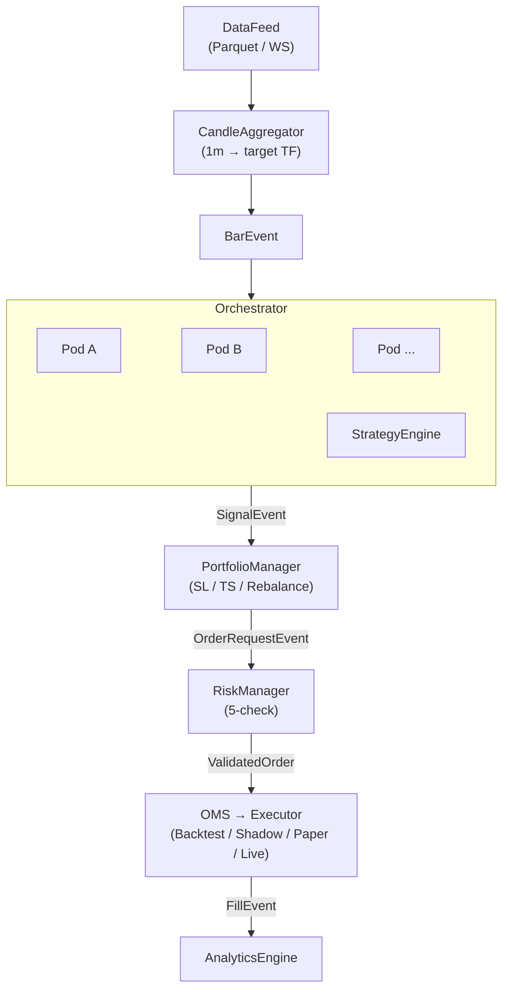
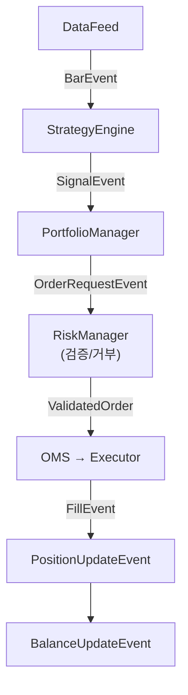
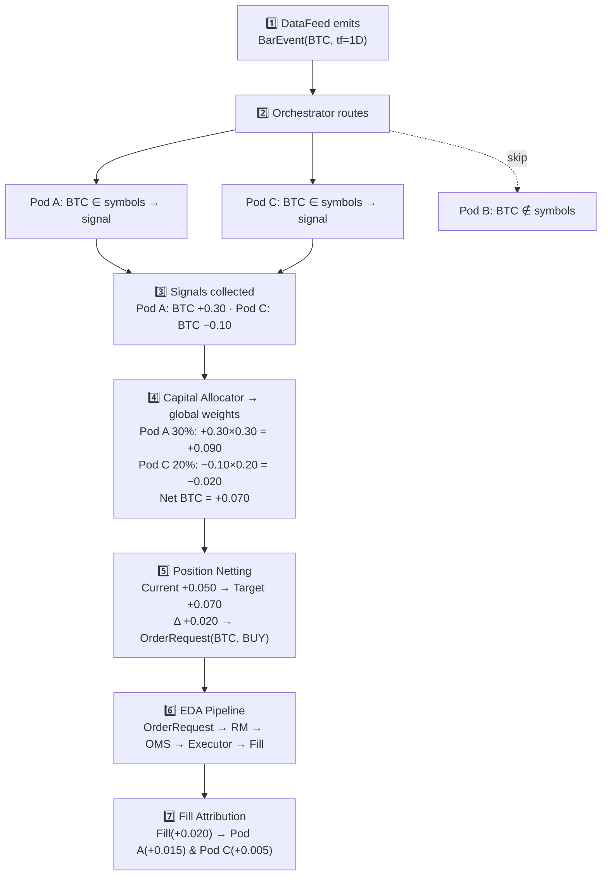
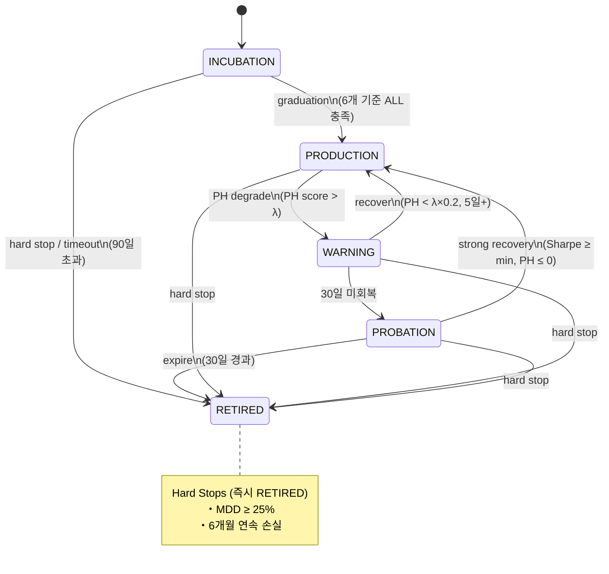
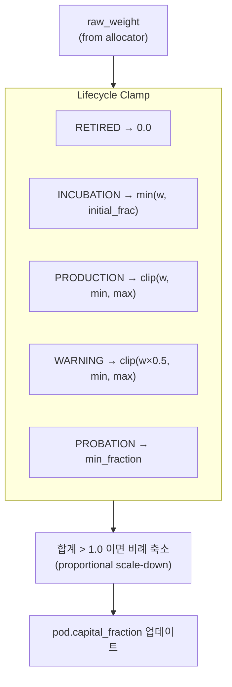
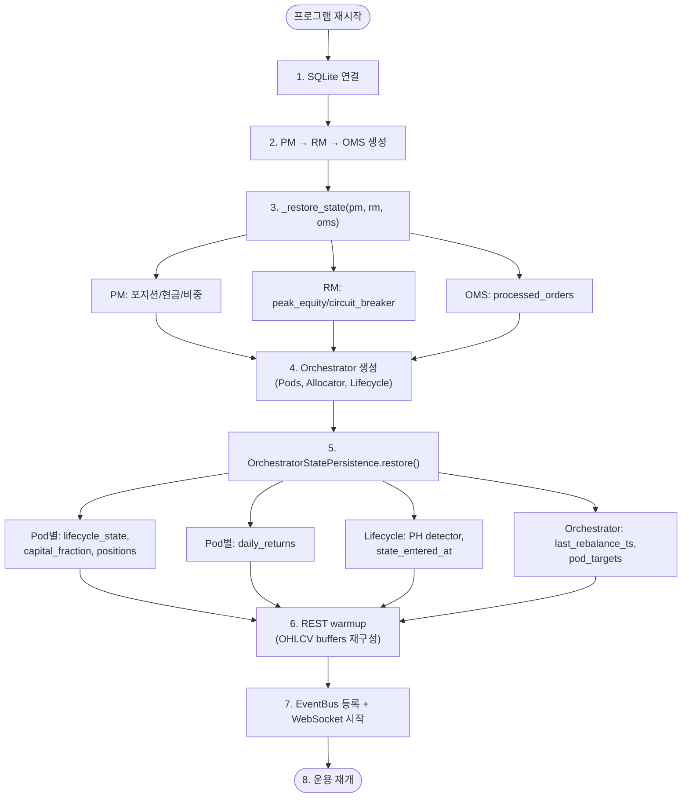
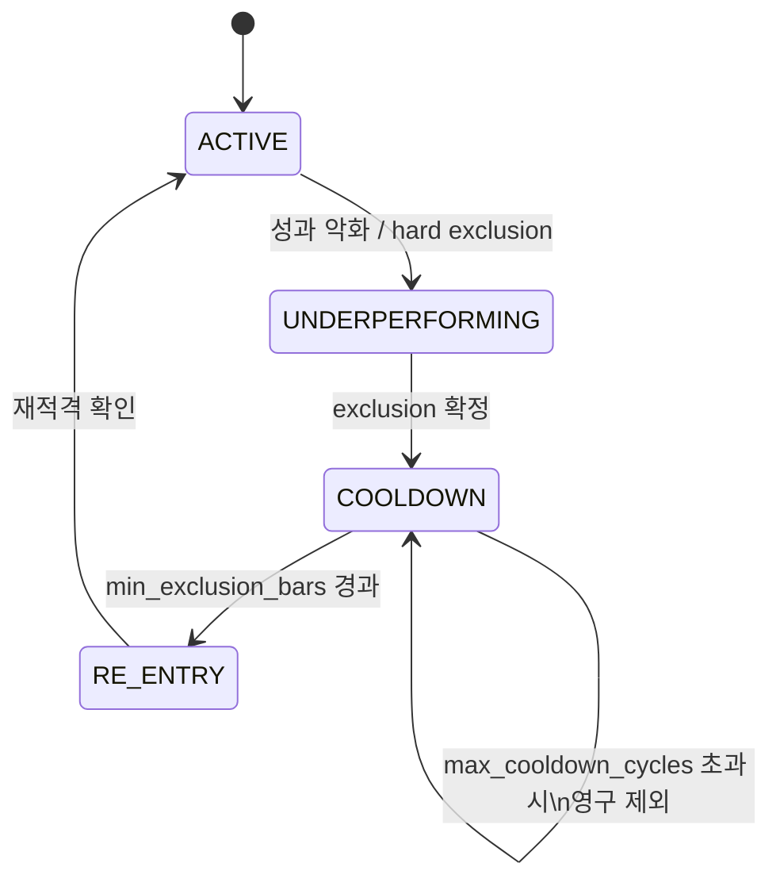

# EDA + Orchestrator Architecture

Event-Driven Architecture(EDA) 기반 트레이딩 시스템과
멀티 전략 오케스트레이터의 통합 아키텍처 레퍼런스.

**핵심 원칙:**

1. **Stateless Strategy / Stateful Execution** -- 전략은 시그널만 생성, PM/RM/OMS가 상태 관리
1. **Backtest-Live Parity** -- 백테스트와 라이브에서 동일한 코드 실행
1. **멱등성** -- `client_order_id`로 중복 주문 방지
1. **Fail-Safe 3단계 방어** -- PM -> RM -> OMS
1. **Look-Ahead Bias 차단** -- Signal at Close -> Execute at Next Open



---

## 2. Event System

### 2.1 Event Chain



### 2.2 Event Types

모든 이벤트는 `BaseEvent(BaseModel, frozen=True)`를 상속하며
`event_id`, `event_type`, `timestamp`, `correlation_id`, `source` 필드를 공유한다.

| Domain | Event | Publisher | Subscriber |
|--------|-------|-----------|------------|
| Market | `BarEvent` | DataFeed | StrategyEngine, AnalyticsEngine |
| Strategy | `SignalEvent` | StrategyEngine | PortfolioManager |
| Execution | `OrderRequestEvent` | PortfolioManager | RiskManager |
| Execution | `OrderAckEvent` | OMS | AnalyticsEngine |
| Execution | `OrderRejectedEvent` | RiskManager / OMS | AnalyticsEngine |
| Execution | `FillEvent` | OMS (Executor) | PortfolioManager, AnalyticsEngine |
| Portfolio | `PositionUpdateEvent` | PortfolioManager | RiskManager |
| Portfolio | `BalanceUpdateEvent` | PortfolioManager | RiskManager |
| Risk | `RiskAlertEvent` | RiskManager | AnalyticsEngine |
| Risk | `CircuitBreakerEvent` | RiskManager | OMS (전량 청산) |
| System | `HeartbeatEvent` | 각 컴포넌트 | Monitor |
| System | `ReconnectEvent` | LiveDataFeed | Monitor |

### 2.3 EventBus

In-process async EventBus (`asyncio.Queue` 기반, 단일 프로세스).

| Feature | Description |
|---------|-------------|
| Type-safe subscribe | `subscribe(EventType, handler)` |
| Bounded queue | `asyncio.Queue(maxsize=N)` -- backpressure |
| Event log | 모든 이벤트 JSONL 기록 (audit trail + replay) |
| Load shedding | `BarEvent`: stale 드롭 / `SignalEvent`, `FillEvent`: 절대 드롭 금지 |

> `flush()` 호출 필수 -- bar-by-bar 동기 처리 보장.

---

## 3. Components

### 3.1 DataFeed

데이터 소스 추상화. 히스토리컬/실시간 동일 인터페이스.

| Implementation | Source | Usage |
|----------------|--------|-------|
| `HistoricalDataFeed` | Silver Parquet (1m) bar-by-bar replay | EDA Backtest |
| `LiveDataFeed` | WebSocket (CCXT Pro) 실시간 스트림 | Shadow/Paper/Live |

### 3.2 CandleAggregator

1m 원본 데이터를 target timeframe(4h, 1D 등)으로 집계.
Multi-TF 지원: `MultiTimeframeCandleAggregator`가 여러 TF를 동시 집계하여
각 TF의 `BarEvent`를 독립 발행한다.

### 3.3 StrategyEngine

`BaseStrategy`를 이벤트 기반으로 래핑하는 어댑터.

- `BarEvent` 수신 -> 내부 버퍼에 OHLCV 누적
- lookback 기간 충족 시 `strategy.run_incremental()` 호출
- 시그널 변화 시 `SignalEvent` 발행
- 기존 BaseStrategy 코드 변경 없이 래퍼 패턴으로 동작

### 3.4 PortfolioManager

`SignalEvent` -> `OrderRequestEvent` 변환 + Position Risk Management.

- **Equity 계산**: `cash + long_notional - short_notional`
  (notional = size x price, unrealized PnL 포함)
- **Rebalance**: 현재 vs 목표 비중 차이 >= `rebalance_threshold` 시 주문 생성
- **Position Stop-Loss**: Intrabar(`bar.low`/`bar.high`) 또는 Close 기준
- **Trailing Stop (ATR)**: `close < peak - atr(14) * multiplier` (LONG)
- **Deferred Execution**: 시그널 bar에서 기록, 다음 bar open에서 체결 (look-ahead bias 차단)
- 매 Bar `BalanceUpdateEvent` 발행 -> RM의 system stop-loss가 실시간 drawdown 추적

### 3.5 RiskManager

`OrderRequestEvent` 사전 검증. 통과 시 OMS로 전달, 거부 시 `OrderRejectedEvent` 발행.

| Check | Rule |
|-------|------|
| Max Leverage | aggregate leverage <= `max_leverage_cap` (2.0x) |
| System Stop-Loss | 포트폴리오 손실 >= `system_stop_loss` (10%) -> CircuitBreaker |
| Position Limit | 동시 포지션 <= `max_open_positions` (8) |
| Order Size | 단일 주문 <= `max_order_size_usd` |

### 3.6 OMS + Executors

`ExecutionMode`별 Executor 주입 (Strategy Pattern).

| Mode | Executor | Behavior |
|------|----------|----------|
| BACKTEST | `BacktestExecutor` | 다음 Bar open 가격 시뮬레이션 체결 |
| SHADOW | `ShadowExecutor` | 주문 로깅만 (체결 없음) |
| PAPER | `BacktestExecutor` | 실시간 데이터 + 시뮬레이션 체결 |
| LIVE | `LiveExecutor` | Binance Futures API 실주문 |
| LIVE+Smart | `SmartExecutor(LiveExecutor)` | Limit 우선 → timeout 시 Market fallback |

`client_order_id`로 멱등성 보장. OMS가 중복 주문 자동 필터링.

**SmartExecutor** (Decorator 패턴):

- `LiveExecutor`를 래핑하여 Limit order 우선 실행
- Urgency 분류: SL/TS/close → market (즉시), entry/rebalance → limit (비용 절감)
- `SmartExecutorConfig`로 timeout, offset, deviation 등 제어
- `OrchestratorConfig.smart_execution` → `PortfolioManagerConfig` → Executor 자동 연결
- 백테스트: `BacktestExecutor(smart_execution=True)` → maker fee + 0 slippage 적용

### 3.7 AnalyticsEngine

모든 이벤트 구독 -> 실시간 메트릭 수집 -> `BacktestResult` 생성.
Trade 기록, PnL 시계열, 포지션 변화를 추적하며
기존 `PerformanceMetrics` 스키마를 재사용한다.

---

## 4. Orchestrator

### 4.1 Ensemble vs Orchestrator

| 비교 | Ensemble | Orchestrator |
|------|----------|-------------|
| 시그널 결합 | 단일 값으로 합산 | **독립 포지션**, 심볼별 넷팅 |
| 자본 배분 | 시그널 가중치만 | **전략별 독립 자본 슬롯** |
| P&L 추적 | 포트폴리오 단위 | **전략별 독립** + 전체 합산 |
| 생애주기 | 수동 on/off | 자동 승격/경고/퇴출 |
| 리스크 | 포트폴리오 단일 SL/TS | 전략별 + 포트폴리오 이중 관리 |

> 공존 가능 -- Pod 내부의 전략이 EnsembleStrategy일 수 있다.

### 4.2 Data Flow



### 4.3 Pod = Independent Execution Unit

각 Pod는 하나의 `BaseStrategy`를 래핑하고
독립적인 심볼 세트, 자본 슬롯, P&L을 관리한다.

```text
┌─────────────────────────────────┐
│          StrategyPod            │
│                                 │
│  BaseStrategy (run_incremental) │
│  Config (pod_id, symbols, TF)  │
│                                 │
│  Internal State:               │
│    _state: LifecycleState      │
│    _capital_fraction: 0.30     │
│    _buffers: {sym: [OHLCV]}    │
│    _target_weights: {sym: w}   │
│    _positions: {sym: PodPos}   │
│    _daily_returns: [r1, r2..]  │
│    _performance: PodPerformance│
└─────────────────────────────────┘
```

### 4.4 Position Netting

여러 Pod이 동일 심볼에 반대 포지션을 가질 수 있다.
거래소에는 넷팅된 단일 포지션만 유지하여 마진 효율을 극대화한다.

```text
Pod A: BTC +0.30, ETH +0.20
Pod B: BTC -0.10, SOL +0.15
Pod C: BTC +0.05, ETH -0.10
────────────────────────────
Net:   BTC +0.25, ETH +0.10, SOL +0.15  <- 실제 거래소 주문
```

**Netting Offset Monitoring**: `NettingStats`가 gross/net/offset_ratio를
추적하며 offset > 50% 시 warning 로깅.

### 4.5 Fill Attribution

Fill은 각 Pod의 target_weight 비율에 따라 비례 귀속된다.
BUY fill -> long pod들에만, SELL fill -> short pod들에만 귀속.

---

## 5. Capital Allocation

### 5.1 3-Layer Structure

```text
Layer 1: Base Allocation        Layer 2: Kelly Overlay       Layer 3: Lifecycle Clamp
────────────────────────        ──────────────────────       ────────────────────────
Risk Parity (ERC)               Blend with Kelly             State-based clamp
 - min 0.5w'Sigma*w             - f* = Sigma^-1 * mu        INCUBATION: <= initial
 - s.t. w>=0, Sum(w)=1          - alpha = conf x frac       PRODUCTION: dynamic
                                 - w=(1-a)*rp + a*kelly      WARNING:    x 0.5
   OR fallbacks:                  confidence ramp:            PROBATION:  = min
   - Inverse Volatility          0d -> 0.0 (pure RP)        RETIRED:    = 0
   - Equal Weight                 180d -> kelly_fraction
```

### 5.2 4 Allocation Algorithms

| Algorithm | Method | When |
|-----------|--------|------|
| **Equal Weight** | `1/N` | 초기 또는 데이터 부족 |
| **Inverse Volatility** | `(1/sigma_i) / Sum(1/sigma_j)` | **3-Pod 추천** (리스크 균등화) |
| **Risk Parity (ERC)** | Spinu convex optimization | 5+ Pod (상관관계 반영) |
| **Adaptive Kelly** | RP + Kelly blend | 충분한 track record 존재 시 |

> **운용 가이드**: 3-Pod 소규모 포트폴리오에서는 `inverse_volatility`가 최적.
> Risk Parity는 상관 추정 오차가 3-Pod에서 과적합 위험이 있으며,
> Equal Weight는 변동성 높은 Pod에 과배분하여 리스크 불균형 발생.

### 5.3 Intra-Pod Asset Allocation

Pod 간 배분(Capital Allocator)과 별개로, Pod 내 에셋 간 차등 배분을 지원한다.
Equal Weight에서 고변동 에셋이 리스크를 지배하는 문제를 해결한다.

**2단계 배분 구조:**

```text
Level 1: Pod 간 배분 (Capital Allocator)
  └─ equal_weight, inverse_volatility, risk_parity, adaptive_kelly

Level 2: Pod 내 에셋 배분 (IntraPodAllocator)
  └─ equal_weight, inverse_volatility, risk_parity, signal_weighted
```

| Method | Formula | Description |
|--------|---------|-------------|
| `equal_weight` | `w_i = 1/N` | 균등 (기본값) |
| `inverse_volatility` | `w_i = (1/sigma_i) / Sum(1/sigma_j)` | 저변동 에셋 우대 |
| `risk_parity` | `w_i * sigma_i = w_j * sigma_j` | 리스크 기여 균등화 |
| `signal_weighted` | `w_i = abs(s_i) / Sum(abs(s_j))` | 시그널 강도 비례 |

설계 주의: 변동성 계산에 `shift(1)` 적용 (look-ahead bias 방지),
PM의 `asset_weights`는 1.0 고정 (중복 적용 방지),
`min_weight`/`max_weight` clamp으로 과도한 집중 방지.

### 5.4 Rebalance Triggers

| Mode | Condition | Default |
|------|-----------|---------|
| CALENDAR | N일 간격 | 7일 |
| THRESHOLD | PRC drift > threshold | 10% |
| HYBRID | CALENDAR OR THRESHOLD | 기본값 |

**Turnover Filter**: 총 턴오버 < `min_rebalance_turnover` (2%) 시 스킵.
Risk defense는 turnover 제약을 우회한다 (`risk_defense_bypass_turnover=True`).

---

## 6. Pod Lifecycle

### 6.1 State Machine



### 6.2 Transition Table

| From | To | Trigger | Condition |
|------|----|---------|-----------|
| INCUBATION | PRODUCTION | Graduation | 6개 기준 ALL 충족 |
| INCUBATION | RETIRED | Timeout | `max_incubation_days`(90) 경과 |
| PRODUCTION | WARNING | PH Detection | PH score > lambda |
| WARNING | PRODUCTION | Recovery | PH score < lambda*0.2 AND 5일+ 경과 |
| WARNING | PROBATION | Timeout | 30일 미회복 |
| PROBATION | PRODUCTION | Strong Recovery | Sharpe >= min_sharpe AND PH score <= 0 |
| PROBATION | RETIRED | Expired | probation_days(30) 경과 |
| ANY | RETIRED | Hard Stop | MDD >= 25% OR 6개월 연속 손실 |

### 6.3 State Details

**INCUBATION** (초기 관찰):

- 자본: `min(allocated, initial_fraction)` -- 상한 고정
- 졸업 기준 (모두 동시 충족):
  `min_live_days`(30), `min_sharpe`(0.5), `max_drawdown`(20%),
  `min_trade_count`(5), `min_calmar`(0.3), `max_portfolio_correlation`(0.65)
- 90일 초과 시 자동 RETIRED (저성과 전략 자본 점유 방지)

**PRODUCTION** (본격 운용):

- 자본: `clip(allocated, min_fraction, max_fraction)` -- 동적 범위
- Page-Hinkley Detector로 지속적 음의 drift 감지 시 WARNING 전이

**WARNING** (성과 악화):

- 자본: `allocated * 0.5` (즉시 50% 감축)
- Recovery: PH score < lambda*0.2 AND 5일+ -> PRODUCTION (PH reset)
- 30일 미회복 -> PROBATION

**PROBATION** (유예 기간):

- 자본: `min_fraction` 고정 (최소 유지)
- Strong Recovery: Sharpe >= min_sharpe AND PH score <= 0 -> PRODUCTION
- 30일 경과 미회복 -> RETIRED

**RETIRED** (운용 종료):

- 자본: 0.0 -- 포지션 청산, Terminal state (복귀 불가)

### 6.4 Capital Clamp Summary



### 6.5 Degradation Detection (Page-Hinkley)

```text
x_bar_t = alpha * x_bar_{t-1} + (1-alpha) * x_t    (EWMA, alpha=0.99)
m_t += x_bar_t - x_t - delta                        (누적 편차, delta=0.005)
M_t = min(M_t, m_t)                                 (최소값 추적)

Detection: m_t - M_t > lambda                        (lambda=50.0)
```

**Auto-Initialization**: Live 시작 시 `auto_init_detectors()`가
백테스트 수익률에서 GBM/Distribution/RANSAC 검출기를 자동 초기화한다.

---

## 7. Risk Architecture

### 7.1 3-Layer Leverage Defense

```text
Strategy signal (unbounded)
  -> Layer 1: min(strength, pod.max_leverage)       [per-symbol]
  -> Layer 2: sum(|w|) <= max_leverage * cap_frac   [per-pod aggregate]
  -> Layer 3: scale_weights_to_leverage(max_gross)  [portfolio]
  -> RM execution cap                               [external]
```

Pod는 자기 자본을 1.0으로 인식. strength > 1.0 = 레버리지 요청.

### 7.2 Portfolio Risk 5-Check

| # | Check | Default Threshold | Severity |
|---|-------|-------------------|----------|
| 1 | Gross Leverage | <= 3.0x | Critical |
| 2 | Portfolio Drawdown | <= 15% | Critical |
| 3 | Daily Loss | <= 3% | Critical |
| 4 | Single Pod PRC | <= 40% | Warning/Critical |
| 5 | Correlation Stress | avg corr <= 0.70 | Warning/Critical |

- **Warning**: 임계값의 80% 도달
- **Critical**: 100% 초과 -> `_risk_breached` 활성화 -> 모든 weight 0 (방어 모드)
- **2-Pod 보완**: Pod < 3이면 에셋 레벨 close price에서 상관행렬 계산

### 7.3 Risk Defense Gradual Recovery

Critical alert 해제 후 `risk_recovery_steps` (기본 3)에 걸쳐 점진 복원.
각 단계에서 `step / total_steps` 비율로 weight를 스케일링한다.
복원 중 재위기 발생 시 즉시 리셋하여 방어 모드로 전환한다.

### 7.4 Signal Suppression & Asset Extinction

Pod의 모든 에셋이 AssetSelector에 의해 제외된 경우
(`asset_selector.all_excluded`), 내부 상태 갱신은 유지하되
시그널 누적/전파를 차단한다 (`should_emit_signals` property).

**Asset Extinction → Pod Retirement**: `min_active_assets: 0` 설정 시
전체 에셋 전멸을 허용하며, 이 상태가 지속되면 Lifecycle의 성과 악화 감지를
통해 Pod retirement가 트리거된다. 전략이 더 이상 유효한 에셋을 보유하지
못한다면 해당 Pod 자체를 퇴출하는 것이 자본 효율적이다.

---

## 8. Execution Modes

### 8.1 Mode Comparison

| Mode | Data Source | Execution | Capital | Risk |
|------|-----------|-----------|---------|------|
| **BACKTEST** | Silver Parquet (bar-by-bar) | Simulation (next open) | Virtual | 0 |
| **SHADOW** | Live WebSocket | None (signal logging) | None | 0 |
| **PAPER** | Live WebSocket | Simulation | Virtual | 0 |
| **LIVE** | Live WebSocket | Binance Futures API | Real | Real |

### 8.2 Deferred Execution

Look-ahead bias 방지의 핵심 메커니즘.

1. 시그널 bar의 `close` 시점에 시그널 생성
1. `_deferred_signals` 큐에 저장
1. 다음 bar의 `open` 시점에 주문 실행

백테스트와 라이브 모두 동일한 deferred 로직을 사용하여 parity 보장.

### 8.3 Backtest-Live Parity

| Layer | Shared Code |
|-------|-------------|
| Strategy | `BaseStrategy.run_incremental()` |
| PM | `PortfolioManager` (SL/TS/Rebalance) |
| RM | `RiskManager` (5-check) |
| OMS | `OMS` (routing, idempotency) |

DataFeed와 Executor만 모드별로 교체. 나머지 전 레이어가 공유 코드.

### 8.4 Cost Model (Maker/Taker 분리)

`OrchestratorConfig`에서 maker/taker 수수료를 독립 설정한다.
SmartExecutor가 entry를 limit order로 실행하므로 maker fee(2bps)를 적용하고,
SL/TS 등 긴급 주문은 taker fee(4bps)를 적용한다.

| 필드 | 설명 | 기본값 |
|------|------|--------|
| `cost_bps` | Taker 비용 (bps) | 4.0 |
| `maker_fee_bps` | Maker 비용 (bps), `None` → `cost_bps`와 동일 | `None` |

```text
_derive_pm_config() 변환:
  cost_bps=4.0, maker_fee_bps=2.0
  → CostModel(taker_fee=0.0004, maker_fee=0.0002, slippage=0.0001)
```

---

## 9. State Persistence & Recovery

### 9.1 Persistence Coverage

```text
┌──────────────────────────────────────────────────┐
│           State Persistence Coverage              │
│                                                   │
│  EDA Layer:                                       │
│    PM: positions, cash, weights -> bot_state     │
│    RM: peak_equity, circuit_breaker -> bot_state │
│    OMS: processed_orders -> bot_state            │
│                                                   │
│  Orchestrator Layer:                              │
│    Pod: lifecycle_state, fraction, positions,     │
│         performance, target_weights, daily_returns│
│    Lifecycle: PH detector, state_entered_at,     │
│              consecutive_loss_months              │
│    Orchestrator: rebalance_ts, pod_targets,       │
│         risk_breached, risk_recovery_step         │
│    Histories: allocation(500), lifecycle(100),    │
│         risk_contributions(500)                   │
│                                                   │
│  Stateless (영속 불필요):                          │
│    CapitalAllocator, RiskAggregator, Netter       │
└──────────────────────────────────────────────────┘
```

### 9.2 SQLite Layout

```text
SQLite (bot_state key-value table)
├── "pm_state"                     <- PM 포지션/현금
├── "rm_state"                     <- RM peak_equity
├── "oms_processed_orders"         <- OMS 멱등성 set
├── "orchestrator_state"           <- Pod/Lifecycle/Orchestrator 전체
├── "orchestrator_daily_returns"   <- Pod별 수익률 이력 (270일 trim)
└── "orchestrator_histories"       <- allocation/lifecycle/risk 이력
```

### 9.3 Recovery Flow



### 9.4 Graceful Degradation

| Scenario | Behavior |
|----------|----------|
| 저장 상태 없음 (첫 실행) | Config 기본값으로 시작 |
| Config에 Pod 추가 | 새 Pod -> INCUBATION |
| Config에서 Pod 제거 | 저장 상태 무시 |
| JSON 파싱 실패 | 경고 로그 + 기본값 |

---

## 10. Dynamic Universe

### 10.1 MarketSurveillance

주기적으로 거래소를 스캔하여 운영 대상 자산을 동적으로 관리한다.
Volume/OI 기준 상위 자산을 선별하고, 유니버스 변경 시 이벤트 발행.

### 10.2 AssetSelector FSM

Pod 내 개별 에셋의 적격성을 4-state FSM으로 관리한다.



- **Hard exclusion**: `hard_exclude_sharpe` (< -1.0) 또는 `hard_exclude_drawdown` (> 25%) 즉시 제외
- **Absolute thresholds**: `absolute_min_sharpe`, `absolute_max_drawdown` (cross-sectional과 독립 평가)
- **Permanent exclusion**: `max_cooldown_cycles` 초과 시 영구 제외
- **Cooldown**: `min_exclusion_bars` (기본 30봉) 동안 재진입 차단
- **min_active_assets**: `0`이면 전체 에셋 전멸 허용 → Pod retirement 트리거 가능 (Section 7.4)
- All-excluded pod: 내부 갱신은 유지하되 시그널 발행 차단 (Section 7.4)

---

## 11. Configuration Reference

### 11.1 Minimal Operational Example

```yaml
orchestrator:
  allocation_method: inverse_volatility   # 3-Pod: 리스크 균등화
  cost_bps: 4.0                           # Taker: 0.04%
  maker_fee_bps: 2.0                      # Maker: 0.02% (Binance VIP0)

  rebalance:
    trigger: hybrid
    calendar_days: 7
    drift_threshold: 0.10

  risk:
    max_gross_leverage: 3.0
    max_portfolio_drawdown: 0.15
    daily_loss_limit: 0.03

  smart_execution:                        # Limit order 우선 실행
    enabled: true
    limit_timeout_seconds: 30
    price_offset_bps: 1.0
    max_price_deviation_pct: 0.3
    fallback_to_market: true

  graduation:
    min_live_days: 30
    min_sharpe: 0.5

  retirement:
    max_drawdown_breach: 0.25
    consecutive_loss_months: 6
    probation_days: 30

pods:
  - pod_id: pod-anchor-mom
    strategy: anchor-mom
    params: { lookback: 30 }
    symbols: [BTC/USDT, ETH/USDT, SOL/USDT]
    timeframe: "12H"
    initial_fraction: 0.15
    max_fraction: 0.40
    min_fraction: 0.05
    risk:
      max_leverage: 2.0
      system_stop_loss: 0.10
      use_trailing_stop: true
      trailing_stop_atr_multiplier: 3.0
    asset_allocation:
      method: inverse_volatility
      vol_lookback: 60
      rebalance_bars: 5
      min_weight: 0.10
      max_weight: 0.50
    asset_selector:                       # 에셋 자동 퇴출
      enabled: true
      hard_exclude_sharpe: -1.0
      hard_exclude_drawdown: 0.25
      min_exclusion_bars: 30
      min_active_assets: 0                # 전멸 허용 → Pod retirement

backtest:
  start: "2024-01-01"
  end: "2025-12-31"
  capital: 100000
```

> 전체 필드 레퍼런스: [`config/orchestrator-example.yaml`](../config/orchestrator-example.yaml)

---

## 12. Code Map

```text
src/core/
├── events.py              # BaseEvent + EventType enum + 이벤트 타입 계층
└── event_bus.py           # async EventBus (bounded queue, backpressure)

src/eda/
├── data_feed.py              # HistoricalDataFeed (Silver Parquet replay)
├── live_data_feed.py         # LiveDataFeed (WebSocket CCXT Pro)
├── candle_aggregator.py      # 1m -> target TF 집계
├── strategy_engine.py        # BaseStrategy 이벤트 래퍼
├── portfolio_manager.py      # Signal -> Order + SL/TS/Rebalance
├── risk_manager.py           # 주문 사전 검증
├── oms.py                    # OMS + ExecutionMode routing
├── executors.py              # Backtest/Shadow/Paper/Live Executor
├── smart_executor.py         # SmartExecutor (Limit order 우선, Decorator)
├── smart_executor_config.py  # SmartExecutorConfig (Pydantic)
├── analytics.py              # 실시간 메트릭 -> BacktestResult
├── runner.py                 # EDA Backtest runner
├── orchestrated_runner.py    # Orchestrator + EDA 통합 runner
├── live_runner.py            # Live/Shadow/Paper runner
├── reconciler.py             # 거래소 포지션 교차 검증
└── persistence/              # SQLite 상태 저장/복원

src/orchestrator/
├── orchestrator.py        # StrategyOrchestrator (EventBus, 넷팅, 배치)
├── pod.py                 # StrategyPod (전략 래퍼 + 독립 P&L)
├── allocator.py           # CapitalAllocator (EW/IV/RP/Kelly)
├── asset_allocator.py     # IntraPodAllocator (Pod 내 에셋 배분)
├── asset_selector.py      # AssetSelector FSM (에셋 적격성)
├── lifecycle.py           # LifecycleManager (5-state machine)
├── degradation.py         # PageHinkleyDetector (CUSUM variant)
├── netting.py             # compute_net_weights, attribute_fill
├── risk_aggregator.py     # RiskAggregator (PRC, 5-check)
├── config.py              # OrchestratorConfig, PodConfig
├── models.py              # LifecycleState, PodPerformance, etc.
├── state_persistence.py   # JSON save/restore (SQLite)
├── surveillance.py        # MarketSurveillanceService
├── dashboard.py           # AllocationDashboard
├── metrics.py             # Prometheus gauges
└── result.py              # OrchestratedResult
```
