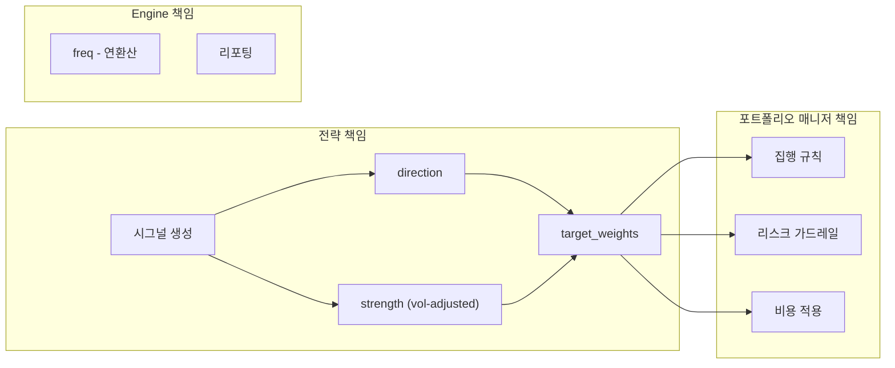
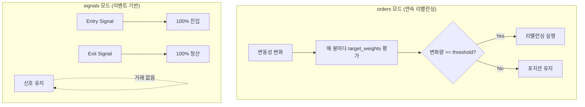

# 🏛️ Advanced Portfolio Manager Architecture

본 문서는 MC Coin Bot의 핵심 엔진인 **고도화된 포트폴리오 매니저**의 설계 아키텍처를 정의합니다. 기존의 단순 신호 기반 매매에서 벗어나, 2026년 현대적 퀀트 트렌드인 **목표 비중(Target Weights)** 기반의 자산 배분 및 리스크 관리 체계를 지향합니다.

> [!IMPORTANT]
> "코드는 곧 돈이다." 모든 설계는 미래 참조 편향(Look-Ahead Bias) 제거와 철저한 리스크 제어를 최우선으로 합니다.

## 1. 핵심 설계 철학 (Core Philosophy)

### 🔹 관심사의 분리 (Separation of Concerns)
좋은 아키텍처는 전략이 엔진(백테스팅 or 실전)에 영향을 받지 않아야 합니다.
- **Strategy Layer (Signal Logic):** 시장 데이터를 분석하여 **방향(Direction)**과 **신호 강도(Strength)**를 계산합니다. 자금 상태를 독립적으로 유지하며 수학적 논리에 집중합니다.
- **PM Layer (Money Management):** 전략의 신호를 받아 계좌 상태(Balance)와 리스크 성향을 고려해 **실제 주문량(Size)**을 결정합니다.

### 🔹 Target Weights 기반 아키텍처
단순히 "사라/팔아라"는 `entries/exits` 신호 대신, **"현재 이 자산의 적정 비중은 X%이다"**라는 `Target Weights`를 관리합니다. 이는 VW-TSMOM(Volatility Weighted Time Series Momentum)과 같은 전략에서 변동성에 따른 정밀한 비중 조절을 가능하게 합니다.

### 🔹 Look-Ahead Bias의 원천 차단
`Signal at Close` → `Execute at Next Open` 원칙을 시스템 레벨에서 강제합니다. 오늘 종가 데이터를 기반으로 계산된 목표 비중은 반드시 다음 캔들의 시가(Open)에 집행됩니다.

### 🔹 Fail-Safe & 리스크 표준
- **격리 마진 (Isolated Margin):** 포지션별로 증거금을 독립시켜, 강제 청산 시 해당 포지션의 증거금만 손실되도록 합니다.
- **단방향 모드 (One-Way Mode):** 하나의 종목에 대해 Long 또는 Short 중 하나만 보유합니다.
- **서버 사이드 스탑 (Server-side Stop):** 주문 시 자동으로 손절 주문을 함께 등록하여 봇 장애 시에도 자산을 보호합니다.

---

## 2. 시스템 아키텍처 (System Architecture)

포트폴리오 매니저는 전략 계층(Strategy Layer)에서 전달받은 신호를 바탕으로 실제 주문을 생성하고 집행하는 브레인 역할을 수행합니다.

```mermaid
graph TD
    subgraph Strategy Layer
        A[Market Data] --> B[Indicator Calculation]
        B --> C[Signal Generation]
        C --> D[Volatility Targeting]
        D --> E[Target Weights Calculation]
    end

    subgraph Portfolio Manager (Execution Layer)
        E --> F{Rebalancing Logic}
        F -->|Threshold Check| G[Order Generation]
        G --> H[Risk Engine: SL/TP/Kill-Switch]
        H --> I[Exchange Adapter]
    end

    subgraph Monitoring & Reporting
        I --> J[Trade Execution]
        J --> K[Performance Analysis: QuantStats]
        K --> L[Discord Notification]
    end
```

---

## 3. 핵심 모듈 상세 (Module Details)

### 3.1. 설정 객체 분리 (Config Separation)
전략의 수학적 파라미터와 자금 운용 파라미터를 Pydantic 모델로 엄격히 분리합니다.

```python
from pydantic import BaseModel, Field

# 1. 전략 설정 (수학적 논리)
class TSMOMConfig(BaseModel):
    lookback: int = 24          # 모멘텀 기간
    vol_window: int = 24        # 변동성 기간
    vol_target: float = 0.15    # 목표 변동성 (신호 강도 계산용)

# 2. PM 설정 (자금 및 리스크)
class PortfolioConfig(BaseModel):
    init_cash: float = 10000.0
    leverage: float = 10.0
    sl_stop: float = 0.02       # 전략적 손절 (2%)
    order_size_pct: float = 1.0 # 자산 대비 투입 비중 (100%)
    fees: float = 0.0004
```

### 3.2. 자금 관리 (Money Management)
`vectorbt`의 `from_orders` 엔진을 활용하여 연속적인 리밸런싱을 수행합니다.

- **Size Type:** `targetpercent`를 사용하여 현재 보유량과 목표 비중의 차이만큼만 매매를 발생시켜 거래 비용을 최적화합니다.
- **Continuous Rebalancing:** 신호가 유지되더라도 변동성 변화에 따라 비중을 동적으로 조절합니다.

### 3.3. 실행 및 비용 모델 (Execution & Cost Model)
실전과 백테스트의 괴리를 최소화하기 위해 보수적인 비용 모델을 적용합니다.

| 항목 | 설정값 (권장) | 비고 |
| :--- | :--- | :--- |
| **Fees** | 0.06% ~ 0.1% | Taker Fee + Slippage + Funding Buffer 합산 |
| **Slippage** | 0.01% | 고정 슬리피지 적용 |
| **Execution Price** | Next Open | 신호 발생 다음 봉 시가 체결 |

### 3.4. 리스크 엔진 (Risk Engine)
이중 구조의 리스크 관리 체계를 구축합니다.

1.  **전략 레벨 청산:** ATR 기반 동적 손절 등 전략 로직에 의한 청산.
2.  **엔진 레벨 가드레일:** `sl_stop` (예: 5~10%)을 통한 시스템 오류 및 블랙 스완 대비 최후 방어선.
3.  **Reduce-Only:** 손절 주문은 반드시 `reduceOnly: True` 옵션을 주어 의도치 않은 포지션 생성을 방지합니다.

## 4. 2026 퀀트 트렌드 반영

### 📈 펀딩비 조정 모멘텀 (Funding-Adjusted Momentum)
단순 가격 상승이 아닌, 지불한 펀딩비를 차감한 **순수익(Net Return)** 기반으로 모멘텀을 측정하여 "수익 없는 롱 포지션"을 필터링합니다.

### 📉 CDaR 기반 최적화
MDD의 한계를 극복하기 위해 하위 5% 구간의 평균 낙폭인 **CDaR(Conditional Drawdown at Risk)**을 핵심 리스크 지표로 관리합니다.

---

## 5. 구현 상세 (Implementation Details)

### 5.1. 책임 분리 원칙



- **전략**: 시그널 생성, 변동성 타겟팅, target_weights 계산
- **포트폴리오 매니저**: 집행 규칙, 리스크 가드레일, 비용 적용
- **Engine**: 연환산 계산(freq), 리포팅

### 5.2. PortfolioManagerConfig

전략-독립적인 포트폴리오 집행 설정 클래스가 `src/portfolio/config.py`에 구현되어 있습니다.

```python
from src.portfolio import PortfolioManagerConfig

# VW-TSMOM: 연속 리밸런싱 모드 (기본값)
config = PortfolioManagerConfig(
    execution_mode="orders",
    max_leverage_cap=2.0,
    rebalance_threshold=0.05,
)

# 단순 전략: 이벤트 기반 모드
config = PortfolioManagerConfig(execution_mode="signals")

# 프리셋 사용
conservative = PortfolioManagerConfig.conservative()  # 보수적
aggressive = PortfolioManagerConfig.aggressive()      # 공격적
signals = PortfolioManagerConfig.signals_mode()       # 이벤트 기반
```

**주요 설정 항목:**

| 카테고리 | 설정 | 기본값 | 설명 |
| :--- | :--- | :--- | :--- |
| **Execution** | `execution_mode` | `orders` | 실행 모드 (orders: 연속 리밸런싱, signals: 이벤트 기반) |
| | `price_type` | `next_open` | 체결 가격 (Look-Ahead Bias 방지) |
| | `size_type` | `targetpercent` | 포지션 사이징 방식 |
| | `upon_opposite_entry` | `reverse` | 반대 포지션 진입 시 처리 |
| **Rebalancing** | `rebalance_threshold` | `0.05` (5%) | 리밸런싱 임계값 (거래 비용 최적화) |
| **Risk Guardrails** | `max_leverage_cap` | `3.0` | 최대 레버리지 상한 |
| | `system_stop_loss` | `0.10` (10%) | 시스템 레벨 손절 |
| **Cost** | `cost_model` | `CostModel.binance_futures()` | 거래 비용 모델 |

### 5.3. 실행 모드 비교 (execution_mode)



| 모드 | 사용 전략 | VectorBT 메서드 | 특징 |
| :--- | :--- | :--- | :--- |
| `orders` | VW-TSMOM, 변동성 타겟팅 | `from_orders` | 매 봉 리밸런싱, `rebalance_threshold` 적용 |
| `signals` | 단순 MA 크로스, RSI | `from_signals` | 진입/청산 이벤트에만 반응 |

### 5.4. BacktestEngine 통합

```python
from src.backtest import BacktestEngine, PortfolioManagerConfig
from src.strategy.tsmom import TSMOMStrategy

# VW-TSMOM: 기본 설정 (orders 모드 - 연속 리밸런싱)
engine = BacktestEngine(initial_capital=10000)
result = engine.run(TSMOMStrategy(), ohlcv_df)

# 보수적 설정으로 백테스트
engine = BacktestEngine(
    portfolio_config=PortfolioManagerConfig.conservative(),
    initial_capital=10000,
)
result = engine.run(TSMOMStrategy(), ohlcv_df)
print(result.metrics.sharpe_ratio)

# 이벤트 기반 전략 (signals 모드)
engine = BacktestEngine(
    portfolio_config=PortfolioManagerConfig.signals_mode(),
    initial_capital=10000,
)
result = engine.run(SimpleStrategy(), ohlcv_df)
```

**내부 라우팅:**
- `execution_mode="orders"` → `_create_portfolio_from_orders()` → `vbt.Portfolio.from_orders()`
- `execution_mode="signals"` → `_create_portfolio_from_signals()` → `vbt.Portfolio.from_signals()`

---

## 6. 파일 구조

```
src/
├── portfolio/
│   ├── __init__.py           # 공개 API export
│   └── config.py             # PortfolioManagerConfig
└── backtest/
    ├── engine.py             # BacktestEngine (portfolio_config 통합)
    └── cost_model.py         # CostModel
```

---

> [!TIP]
> 본 아키텍처는 `src/backtest/engine.py`와 `src/portfolio/config.py`에 구현되어 있습니다.
> 실전 트레이딩 모듈(`src/execution/`)에서도 동일한 `PortfolioManagerConfig`를 사용합니다.
