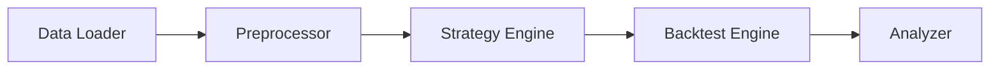

# 🛠️ Strategy Development Guidelines

본 문서는 MC Coin Bot 프로젝트에서 새로운 매매 전략을 개발할 때 준수해야 할 표준 가이드라인을 정의합니다.

> [!IMPORTANT]
> 모든 전략은 백테스팅과 실전 매매에서 동일한 로직을 공유해야 하며, 엔진의 종류에 의존성을 가져서는 안 됩니다.

## 1. 표준 데이터 포맷 (Standardized Input)

모든 전략은 `Pandas DataFrame` 형태의 동일한 데이터를 입력받아야 합니다.

- **필수 컬럼:** `open`, `high`, `low`, `close`, `volume` (소문자 통일)
- **인덱스:** `datetime` (UTC 권장)

## 2. 표준 출력 포맷 (Standardized Output)

전략의 결과물은 다음 두 가지 중 하나여야 합니다.

1.  **Signal Series:** `1` (매수), `-1` (매도), `0` (중립)으로 구성된 시계열 데이터.
2.  **Weight Series:** 포트폴리오 비중 (예: `0.5` = 자산의 50% 투입).

## 3. 백테스팅 엔진 파이프라인 (5단계)

전략 실행은 다음의 표준 파이프라인을 따릅니다.

1.  **데이터 로딩 (Data Loader):** CSV, DB, API에서 원본 데이터를 가져옵니다.
2.  **전처리 (Preprocessor):** 이동평균선, 변동성 등 전략에 필요한 지표를 계산합니다. (로직 공유 필수)
3.  **전략 실행 (Strategy Engine):** 데이터를 보고 신호(Signal) 또는 비중(Weight)을 생성합니다. (로직 공유 필수)
4.  **백테스팅 수행 (Backtest Engine):** 신호를 수익률로 변환하며 수수료, 슬리피지 등을 적용합니다.
5.  **성과 분석 (Analyzer):** 결과를 바탕으로 티어 시트(Tier Sheet)를 생성합니다.

## 4. 백테스팅 vs 실전 매매 비교

| 단계 | 역할 | 백테스팅 (Backtest) | 실전 매매 (Live) | 공유 여부 |
| :--- | :--- | :--- | :--- | :--- |
| **데이터 로딩** | 재료 준비 | 과거 데이터 한꺼번에 로드 | 실시간 API/WebSocket 수신 | ❌ |
| **전처리** | 재료 손질 | 전체 기간 계산 (Vectorized) | 최근 버퍼(Buffer) 기반 계산 | ⭕ |
| **전략 실행** | 판단 (뇌) | 과거 시점 신호 생성 (Series) | 현재 시점 신호 생성 (Scalar) | ⭕ |
| **포트폴리오** | 자금 관리 | 가상 자본 기준 수량 계산 | 실제 잔고 기준 수량 계산 | ⭕ |
| **실행기** | 주문 (손) | 가상 체결 (Paper) | Exchange API 주문 (Real) | ❌ |
| **분석기** | 성적표 | 사후 분석 (QuantStats) | 실시간 모니터링 (Discord) | ❌ |

## 5. 개발 단계별 도구

1.  **전략 연구:** `VectorBT` (초고속 벡터 백테스팅)
2.  **파라미터 최적화:** `VectorBT` (과적합 방지 최적화)
3.  **이벤트 기반 검증:** `Live Engine` (실전 코드 버그 검증)
4.  **모의 매매:** `Exchange API` (Dry Run)
5.  **실전 매매:** `Real Money` (Live)
