# 🚀 고수익 트레이딩 전략 구현 계획서

> [!NOTE]
> 이 문서는 Volume-Weighted TSMOM 및 Adaptive Breakout 전략의 점진적 구현 계획을 정의합니다.
> 
> **대상 독자:** 개발자, 퀀트 연구자  
> **목적:** 구현 로드맵 및 각 단계별 상세 계획 제공

---

## 📋 목차

1. [전략 개요](#1-전략-개요)
2. [구현 로드맵](#2-구현-로드맵)
3. [Phase 1: VW-TSMOM 구현](#3-phase-1-vw-tsmom-구현)
4. [Phase 2: Breakout 전략 추가](#4-phase-2-breakout-전략-추가)
5. [Phase 3: 하이브리드 통합](#5-phase-3-하이브리드-통합)
6. [Phase 4: 라이브 배포](#6-phase-4-라이브-배포)
7. [성공 기준 및 KPI](#7-성공-기준-및-kpi)
8. [리스크 관리](#8-리스크-관리)
9. [벤치마크 비교 및 시각화](#9-벤치마크-비교-및-시각화)
10. [공유 컴포넌트 설계](#10-공유-컴포넌트-설계)

> [!TIP]
> 백테스팅 구현 시 주의사항과 모범사례는 별도 문서를 참조하세요.
> 
> 📄 **[백테스팅 모범사례 가이드](./backtesting-best-practices.md)**

---

## 1. 전략 개요

### 1.1 배경 및 목표

본 프로젝트는 **고변동성 환경에서 높은 수익률**을 추구하는 자동화 트레이딩 시스템 구축을 목표로 합니다.

| 항목 | 목표 |
|------|------|
| 연간 수익률 | 150~300% |
| Sharpe Ratio | 1.5 이상 |
| 최대 낙폭 (MDD) | -50% 이내 |
| 자동화 수준 | 완전 자동화 (24/7) |

### 1.2 선정 전략

학술 연구 및 백테스트 결과를 기반으로 다음 전략들을 선정했습니다.

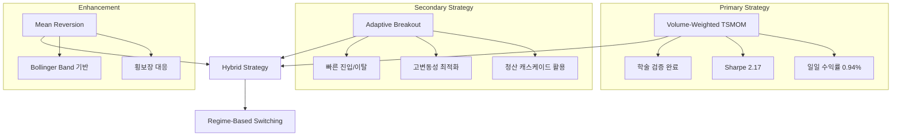

### 1.3 전략별 특성

| 전략 | 시장 환경 | 예상 수익률 | 거래 빈도 |
|------|----------|------------|----------|
| **VW-TSMOM** | 추세장 | 높음 | 중간 |
| **Breakout** | 변동성 폭발 | 매우 높음 | 낮음 |
| **Mean Reversion** | 횡보장 | 중간 | 높음 |

---

## 2. 구현 로드맵

### 2.1 전체 일정

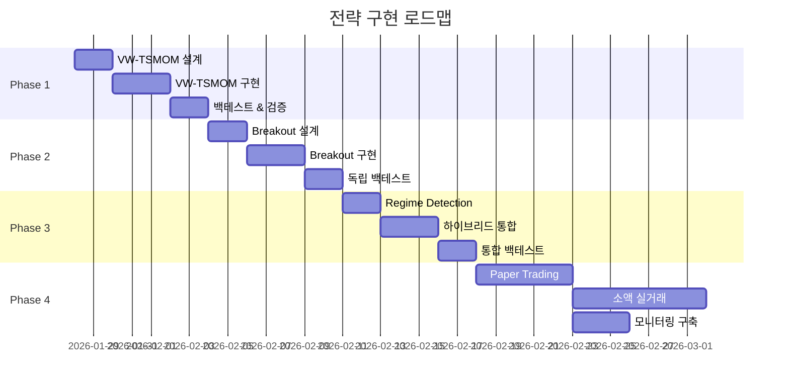

### 2.2 점진적 검증 방식

> [!IMPORTANT]
> 각 Phase는 **이전 Phase의 성공 기준 충족 후** 진행합니다.
> 실패 시 파라미터 튜닝 또는 전략 수정 후 재검증합니다.

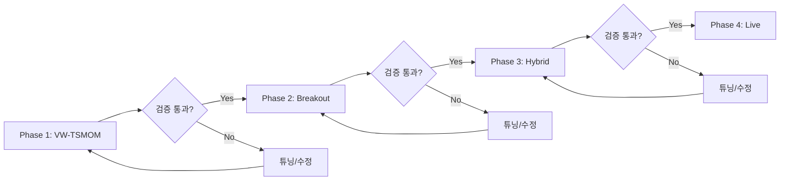

---

## 3. Phase 1: VW-TSMOM 구현

### 3.1 목표

- Volume-Weighted Time Series Momentum 전략 구현
- 단일 종목(BTC, ETH) 백테스트 완료
- 거래 비용 포함 성과 검증

### 3.2 구현 범위

#### 3.2.1 디렉토리 구조

> [!IMPORTANT]
> 아래 구조는 `.cursor/rules/01-project-structure.mdc`를 준수합니다.
> `src/execution/`의 Position/Risk Manager는 **백테스트와 라이브 모두에서 공유**됩니다.

```
src/
├── strategy/                    # Strategy Layer (Brain) - 시그널 생성
│   ├── __init__.py
│   ├── base.py                  # Strategy ABC (추상 기반 클래스)
│   └── tsmom/
│       ├── __init__.py
│       ├── calculator.py        # VW-TSMOM 시그널 계산
│       └── config.py            # TSMOM 전략 설정 (Pydantic)
│
├── models/                      # Domain Models (DTO & Schemas)
│   ├── __init__.py
│   ├── ohlcv.py                 # 기존 OHLCV 모델
│   ├── signal.py                # Signal DTO (NEW)
│   ├── position.py              # Position DTO (NEW)
│   └── trade.py                 # Trade DTO (NEW)
│
├── execution/                   # Execution Layer - 백테스트/라이브 공유
│   ├── __init__.py
│   ├── position_manager.py      # 포지션 추적 (공유)
│   ├── risk_manager.py          # 리스크 관리 (공유)
│   ├── order_executor.py        # 주문 실행 (라이브 전용)
│   └── interfaces.py            # 추상 인터페이스 정의
│
├── backtest/                    # Backtesting & Research
│   ├── __init__.py
│   ├── engine.py                # VectorBT 기반 백테스트 엔진
│   ├── simulator.py             # 시뮬레이션 실행기 (execution 공유)
│   ├── cost_model.py            # 거래비용/슬리피지 모델
│   ├── benchmark.py             # 벤치마크 (Buy & Hold) 비교
│   └── metrics.py               # 성과 지표 계산
│
└── viz/                         # Visualization & Dashboard
    ├── __init__.py
    ├── backtest_report.py       # 백테스트 결과 시각화
    ├── equity_curve.py          # 자산 곡선 차트
    └── benchmark_compare.py     # 벤치마크 비교 차트
```

**의존성 방향 (순환 참조 방지):**

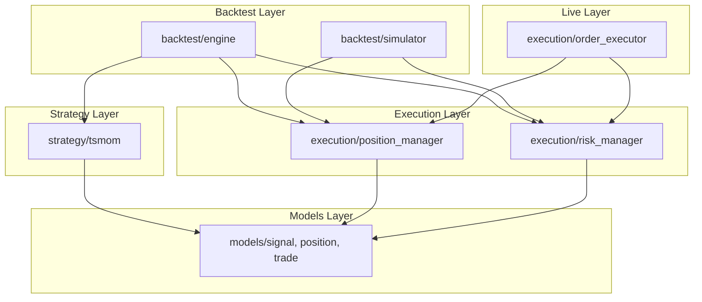

#### 3.2.2 핵심 컴포넌트

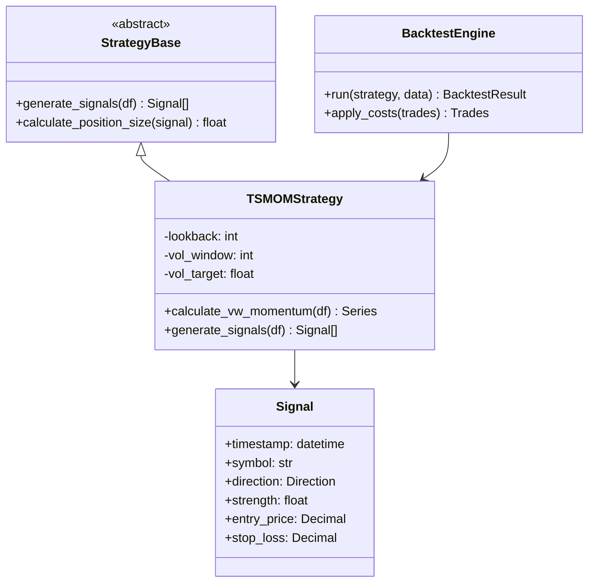

### 3.3 VW-TSMOM 알고리즘

#### 3.3.1 시그널 계산 로직

VW-TSMOM은 과거 수익률(Momentum)에 거래량 신뢰도(Volume Weight)를 결합하여 추세 강도를 산출합니다.

```python
# 의사 코드 (Pseudo-code)
def calculate_vw_tsmom_signal(
    ohlcv: pd.DataFrame,
    lookback: int = 24,      # hours
    vol_window: int = 24,    # hours
    vol_target: float = 0.15 # 연간 변동성 목표 15%
) -> Signal:
    """
    Volume-Weighted Time Series Momentum Signal.
    
    1. 거래량 가중 수익률 계산 (Volume-Weighted Returns)
    2. 변동성 스케일링 적용 (Volatility Scaling)
    3. 포지션 방향 및 크기 결정
    """
    # Step 1: Volume-Weighted Returns
    returns = ohlcv["close"].pct_change()
    vw_returns = (returns * ohlcv["volume"]).rolling(lookback).sum()
    total_volume = ohlcv["volume"].rolling(lookback).sum()
    vw_momentum = vw_returns / total_volume
    
    # Step 2: Volatility Scaling
    # 실현 변동성 계산 및 연율화
    realized_vol = returns.rolling(vol_window).std() * np.sqrt(24 * 365)
    vol_scalar = vol_target / realized_vol.clip(lower=0.05)
    
    # Step 3: Signal Generation
    # 방향(Direction) * 강도(Strength)
    raw_signal = np.sign(vw_momentum) * vol_scalar
    position = raw_signal.clip(-2, 2)  # Max 2x leverage
    
    return position
```

#### 3.3.2 아키텍처 및 설정 (Config)

전략의 수학적 파라미터와 PM 설정을 분리하여 관리합니다.

```python
# 전략 설정 (Strategy Config)
class TSMOMConfig(BaseModel):
    lookback: int = 24
    vol_window: int = 24
    vol_target: float = 0.15

# 포트폴리오 설정 (PM Config)
class PortfolioConfig(BaseModel):
    init_cash: float = 10000.0
    leverage: float = 10.0
    sl_stop: float = 0.02       # 전략적 손절 (격리 마진 안전장치)
    order_size_pct: float = 1.0 # Equity 대비 비중
```

#### 3.3.2 포지션 사이징

| 변수 | 설명 | 기본값 |
|------|------|--------|
| `vol_target` | 연간 목표 변동성 | 15% |
| `max_leverage` | 최대 레버리지 | 3x |
| `position_cap` | 단일 종목 최대 비중 | 100% |

### 3.4 백테스트 설정

#### 3.4.1 비용 모델

| 항목 | 값 | 비고 |
|------|-----|------|
| Maker Fee | 0.02% | 바이낸스 VIP 0 기준 |
| Taker Fee | 0.04% | 시장가 주문 기준 |
| Slippage | 0.05% | 보수적 가정 |
| Funding Rate | 0.01%/8h | 평균 펀딩비 |

#### 3.4.2 데이터 요구사항

- **기간:** 2024-01-01 ~ 2025-12-31 (2년)
- **종목:** BTC/USDT, ETH/USDT
- **타임프레임:** 1시간봉 (1h)
- **소스:** 기존 Bronze 레이어 데이터 활용

### 3.5 성공 기준

| 지표 | 최소 기준 | 목표 |
|------|----------|------|
| Sharpe Ratio | > 1.0 | > 1.5 |
| CAGR | > 50% | > 100% |
| MDD | < -40% | < -30% |
| Win Rate | > 40% | > 50% |
| Profit Factor | > 1.2 | > 1.5 |

### 3.6 산출물

- [ ] `src/strategy/tsmom/` 모듈 구현
- [ ] `src/backtest/engine.py` 구현
- [ ] BTC/ETH 2년 백테스트 결과 보고서
- [ ] 파라미터 민감도 분석 차트

---

## 4. Phase 2: Breakout 전략 추가

### 4.1 목표

- Adaptive Breakout 전략 독립 구현
- 청산 캐스케이드 이벤트 탐지 로직 구현
- 단독 백테스트 및 성과 검증

### 4.2 구현 범위

#### 4.2.1 디렉토리 구조

```
src/strategy/
└── breakout/
    ├── __init__.py
    ├── detector.py         # 브레이크아웃 탐지
    ├── volume_filter.py    # 거래량 서지 필터
    └── config.py           # Breakout 전략 설정
```

### 4.3 Breakout 알고리즘

#### 4.3.1 셋업 탐지

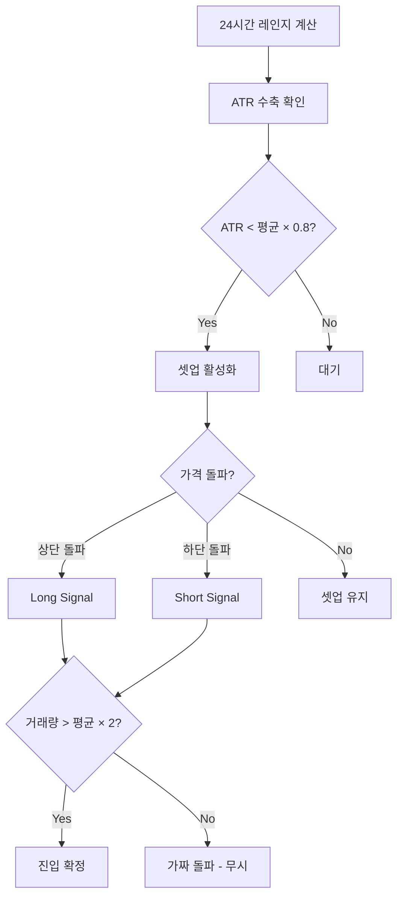

#### 4.3.2 진입/이탈 규칙

| 조건 | 값 |
|------|-----|
| 박스 기간 | 24시간 |
| 돌파 임계값 | 박스 고가/저가 |
| 거래량 필터 | 평균의 2배 이상 |
| 손절 (Stop Loss) | 진입가 ± 2 ATR |
| 이익 실현 | Trailing Stop 2 ATR |
| 최대 보유 기간 | 8시간 |

### 4.4 성공 기준

| 지표 | 최소 기준 |
|------|----------|
| Sharpe Ratio | > 1.0 |
| Win Rate | > 35% |
| Avg Win / Avg Loss | > 2.0 |
| 연간 거래 횟수 | 50~200회 |

### 4.5 산출물

- [ ] `src/strategy/breakout/` 모듈 구현
- [ ] 독립 백테스트 결과 보고서
- [ ] 브레이크아웃 이벤트 분석 (2024-2025)

---

## 5. Phase 3: 하이브리드 통합

### 5.1 목표

- Regime Detection 모듈 구현
- TSMOM + Breakout + Mean Reversion 통합
- 포트폴리오 레벨 리스크 관리

### 5.2 Regime Detection

#### 5.2.1 시장 상태 분류

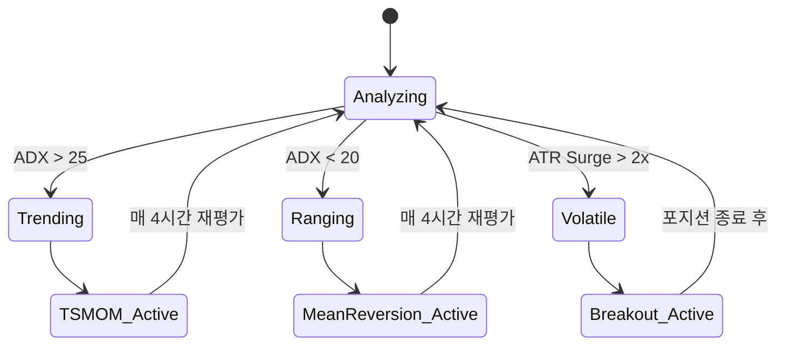

#### 5.2.2 자본 배분

| 시장 상태 | TSMOM | Breakout | Mean Reversion |
|----------|-------|----------|----------------|
| Trending | 70% | 20% | 10% |
| Ranging | 20% | 10% | 70% |
| Volatile | 30% | 50% | 20% |

### 5.3 구현 범위

```
src/strategy/
├── regime/
│   ├── __init__.py
│   ├── detector.py         # ADX, ATR 기반 상태 판단
│   └── allocator.py        # 전략별 자본 배분
└── hybrid/
    ├── __init__.py
    ├── orchestrator.py     # 전략 오케스트레이션
    └── portfolio.py        # 포트폴리오 관리
```

### 5.4 성공 기준

| 지표 | 개별 전략 대비 |
|------|---------------|
| Sharpe Ratio | +10% 이상 개선 |
| MDD | -20% 이상 개선 |
| 월간 수익 일관성 | 변동계수 < 0.5 |

### 5.5 산출물

- [ ] `src/strategy/regime/` 모듈 구현
- [ ] `src/strategy/hybrid/` 모듈 구현
- [ ] 통합 백테스트 보고서 (vs 개별 전략)
- [ ] Walk-Forward Optimization 결과

---

## 6. Phase 4: 라이브 배포

### 6.1 목표

- Paper Trading 검증
- 소액 실거래 테스트
- 모니터링 및 알림 시스템 구축

### 6.2 배포 단계

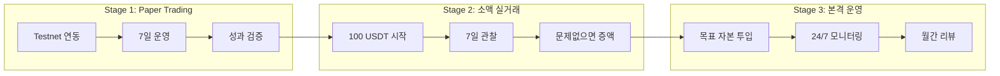

### 6.3 구현 범위

```
src/execution/
├── __init__.py
├── order_manager.py        # 주문 관리 (CCXT)
├── position_tracker.py     # 실시간 포지션 추적
└── risk_guard.py           # Kill Switch, Hard Stop

src/monitoring/
├── __init__.py
├── health_check.py         # 시스템 상태 점검
├── pnl_tracker.py          # 실시간 손익 추적
└── alerter.py              # Discord 알림
```

### 6.4 모니터링 항목

| 항목 | 임계값 | 알림 레벨 |
|------|--------|----------|
| 일일 손실률 | > -5% | ⚠️ WARNING |
| 일일 손실률 | > -10% | 🔴 CRITICAL (Kill Switch) |
| API 오류율 | > 5% | ⚠️ WARNING |
| 포지션 불일치 | 발생 시 | 🔴 CRITICAL |
| 펀딩비 급등 | > 0.1% | ℹ️ INFO |

### 6.5 산출물

- [ ] `src/execution/` 모듈 구현
- [ ] `src/monitoring/` 모듈 구현
- [ ] Discord Webhook 알림 연동
- [ ] Paper Trading 7일 보고서
- [ ] 라이브 운영 체크리스트

---

## 7. 성공 기준 및 KPI

### 7.1 Phase별 Go/No-Go 기준

| Phase | Go 기준 | No-Go 시 조치 |
|-------|---------|--------------|
| Phase 1 | Sharpe > 1.0, CAGR > 50% | 파라미터 튜닝 후 재검증 |
| Phase 2 | Sharpe > 0.8, 독립 수익 창출 | 전략 수정 또는 제외 |
| Phase 3 | 개별 전략 대비 MDD 개선 | 배분 비율 조정 |
| Phase 4 | Paper와 Live 성과 일치 | 코드 디버깅 후 재시도 |

### 7.2 최종 목표 KPI

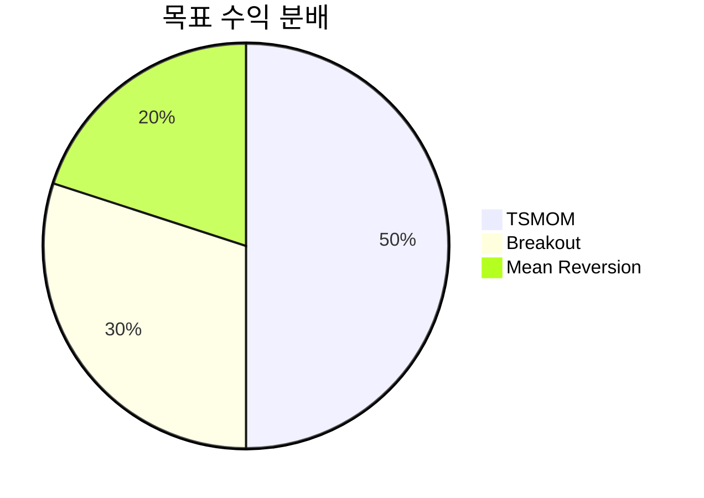

| KPI | 목표 |
|-----|------|
| 연간 수익률 (CAGR) | 150~300% |
| Sharpe Ratio | 1.5~2.0 |
| 최대 낙폭 (MDD) | < -40% |
| 월간 승률 | > 60% |
| 시스템 가동률 | > 99% |

---

## 8. 리스크 관리

### 8.1 기술적 리스크

| 리스크 | 확률 | 영향 | 대응 |
|--------|------|------|------|
| 거래소 API 장애 | 중 | 높음 | 멀티 거래소 지원, 재시도 로직 |
| 과적합 (Overfitting) | 높음 | 높음 | Walk-Forward, 아웃샘플 검증 |
| 슬리피지 과소평가 | 중 | 중 | 보수적 슬리피지 가정 (0.1%) |
| 데이터 품질 이슈 | 낮음 | 중 | Pydantic 검증, 이상치 탐지 |

### 8.2 시장 리스크

| 리스크 | 확률 | 영향 | 대응 |
|--------|------|------|------|
| 블랙스완 이벤트 | 낮음 | 매우 높음 | 일일 손실 한도 (-10%), Kill Switch |
| 레짐 변화 | 중 | 높음 | Regime Detection, 적응형 전략 |
| 유동성 고갈 | 낮음 | 높음 | Top 10 유동성 종목만 거래 |
| 규제 변화 | 중 | 높음 | 뉴스 모니터링, 빠른 대응 |

### 8.3 운영 리스크

| 리스크 | 확률 | 영향 | 대응 |
|--------|------|------|------|
| 서버 다운 | 낮음 | 높음 | 클라우드 이중화, 자동 재시작 |
| 시크릿 유출 | 낮음 | 매우 높음 | `.env` 분리, API Key 권한 최소화 |
| 코드 버그 | 중 | 중~높음 | 테스트 커버리지 > 80%, 코드 리뷰 |

---

## 9. 벤치마크 비교 및 시각화

### 9.1 벤치마크 정의

> [!IMPORTANT]
> 모든 백테스트 결과는 **반드시 벤치마크와 비교**하여 표시합니다.
> "절대 수익률"만으로는 전략의 가치를 판단할 수 없습니다.

| 벤치마크 | 설명 | 용도 |
|----------|------|------|
| **Buy & Hold (B&H)** | 동일 자본으로 시작 시점에 매수 후 보유 | 기본 비교 기준 |
| **Risk-Free Rate** | 연 5% (스테이블코인 예치 수익률 가정) | Sharpe Ratio 계산 |
| **BTC B&H** | BTC 단순 보유 수익률 | 알파 측정 기준 |

### 9.2 필수 비교 지표

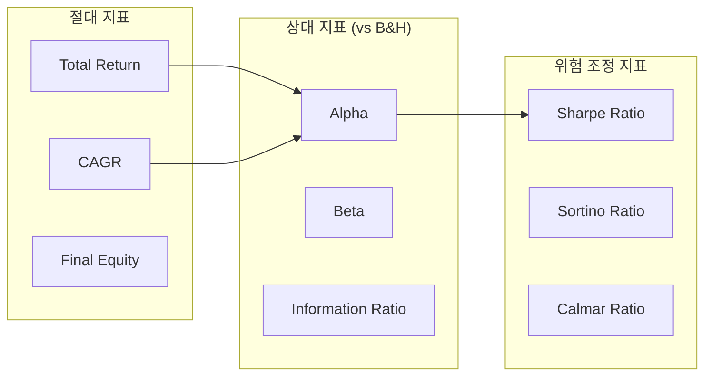

| 지표 | 공식 | 의미 |
|------|------|------|
| **Alpha** | Strategy Return - (Beta × Benchmark Return) | 초과 수익률 |
| **Beta** | Cov(Strategy, Benchmark) / Var(Benchmark) | 시장 민감도 |
| **Information Ratio** | Alpha / Tracking Error | 능동적 위험 대비 초과 수익 |

### 9.3 시각화 표준

#### 9.3.1 필수 차트 목록

| 차트 | 라이브러리 | 용도 |
|------|-----------|------|
| **Equity Curve (자산 곡선)** | Plotly / VectorBT | 전략 vs 벤치마크 누적 수익 |
| **Drawdown Chart** | Plotly | 낙폭 추이 비교 |
| **Monthly Returns Heatmap** | Plotly | 월별 수익률 패턴 |
| **Rolling Sharpe** | Plotly | 시간에 따른 위험 조정 성과 |
| **Trade Distribution** | Plotly | 개별 거래 수익/손실 분포 |

#### 9.3.2 Equity Curve 시각화 예시

```python
# 의사 코드 (Pseudo-code)
import plotly.graph_objects as go
from plotly.subplots import make_subplots

def plot_backtest_result(
    strategy_equity: pd.Series,
    benchmark_equity: pd.Series,
    drawdowns: pd.Series,
) -> go.Figure:
    """전략 vs 벤치마크 비교 차트 생성."""
    fig = make_subplots(
        rows=2, cols=1,
        shared_xaxes=True,
        vertical_spacing=0.05,
        row_heights=[0.7, 0.3],
        subplot_titles=("Equity Curve", "Drawdown"),
    )
    
    # 1. Equity Curve (상단)
    fig.add_trace(
        go.Scatter(
            x=strategy_equity.index,
            y=strategy_equity.values,
            name="Strategy",
            line=dict(color="#00C853", width=2),
        ),
        row=1, col=1,
    )
    fig.add_trace(
        go.Scatter(
            x=benchmark_equity.index,
            y=benchmark_equity.values,
            name="Buy & Hold",
            line=dict(color="#FFA726", width=2, dash="dash"),
        ),
        row=1, col=1,
    )
    
    # 2. Drawdown (하단)
    fig.add_trace(
        go.Scatter(
            x=drawdowns.index,
            y=drawdowns.values * 100,
            name="Drawdown",
            fill="tozeroy",
            line=dict(color="#EF5350"),
        ),
        row=2, col=1,
    )
    
    fig.update_layout(
        template="plotly_dark",
        height=800,
        title="Strategy Performance vs Buy & Hold",
        yaxis_title="Equity ($)",
        yaxis2_title="Drawdown (%)",
    )
    
    return fig
```

#### 9.3.3 결과 리포트 형식

백테스트 완료 후 다음 형식으로 결과를 출력합니다:

```
╔══════════════════════════════════════════════════════════════╗
║                    BACKTEST RESULT SUMMARY                   ║
╠══════════════════════════════════════════════════════════════╣
║  Period: 2024-01-01 ~ 2025-12-31 (730 days)                 ║
║  Symbol: BTC/USDT | Timeframe: 1h                           ║
╠══════════════════════════════════════════════════════════════╣
║                        PERFORMANCE                           ║
╠═══════════════════════╦══════════════╦═══════════════════════╣
║  Metric               ║  Strategy    ║  Buy & Hold (B&H)     ║
╠═══════════════════════╬══════════════╬═══════════════════════╣
║  Total Return         ║  +245.3%     ║  +89.2%               ║
║  CAGR                 ║  +85.7%      ║  +37.5%               ║
║  Sharpe Ratio         ║  1.87        ║  0.92                 ║
║  Max Drawdown         ║  -28.4%      ║  -45.2%               ║
║  Win Rate             ║  52.3%       ║  N/A                  ║
║  Profit Factor        ║  1.67        ║  N/A                  ║
╠═══════════════════════╬══════════════╬═══════════════════════╣
║  Alpha (vs B&H)       ║  +156.1%     ║  --                   ║
║  Beta                 ║  0.73        ║  1.00                 ║
╚═══════════════════════╩══════════════╩═══════════════════════╝
```

---

## 10. 공유 컴포넌트 설계

### 10.1 설계 원칙

> [!IMPORTANT]
> **"백테스트에서 작동하면 라이브에서도 동일하게 작동해야 한다."**
> 
> Position Manager, Risk Manager 등 핵심 로직은 **백테스트와 라이브에서 동일한 코드**를 사용합니다.

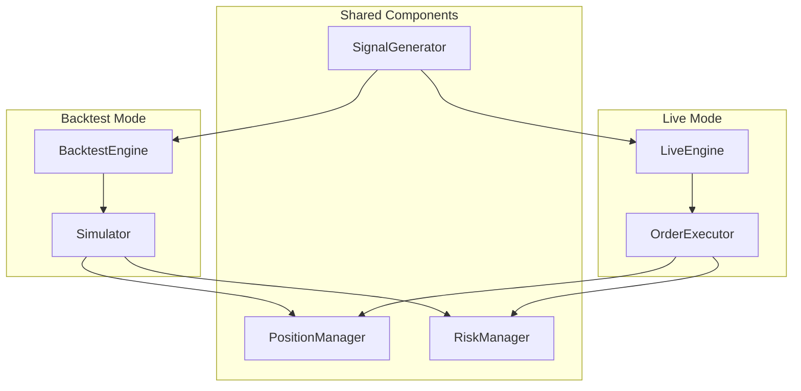

### 10.2 인터페이스 정의

#### 10.2.1 ExecutionContext (실행 컨텍스트)

```python
# src/execution/interfaces.py
from abc import ABC, abstractmethod
from decimal import Decimal
from src.models.position import Position
from src.models.trade import Trade

class IOrderExecutor(ABC):
    """주문 실행 인터페이스 - 백테스트/라이브 공통."""
    
    @abstractmethod
    async def execute_market_order(
        self,
        symbol: str,
        side: str,  # "BUY" | "SELL"
        quantity: Decimal,
    ) -> Trade:
        """시장가 주문 실행."""
        ...
    
    @abstractmethod
    async def execute_limit_order(
        self,
        symbol: str,
        side: str,
        quantity: Decimal,
        price: Decimal,
    ) -> Trade:
        """지정가 주문 실행."""
        ...


class IPositionManager(ABC):
    """포지션 관리 인터페이스 - 백테스트/라이브 공통."""
    
    @abstractmethod
    def get_position(self, symbol: str) -> Position | None:
        """현재 포지션 조회."""
        ...
    
    @abstractmethod
    def update_position(self, trade: Trade) -> Position:
        """거래 결과로 포지션 업데이트."""
        ...
    
    @abstractmethod
    def get_total_exposure(self) -> Decimal:
        """전체 노출도 (레버리지 포함) 계산."""
        ...


class IRiskManager(ABC):
    """리스크 관리 인터페이스 - 백테스트/라이브 공통."""
    
    @abstractmethod
    def check_position_limit(
        self, symbol: str, proposed_quantity: Decimal
    ) -> bool:
        """포지션 한도 확인."""
        ...
    
    @abstractmethod
    def check_drawdown_limit(self, current_equity: Decimal) -> bool:
        """낙폭 한도 확인 (Kill Switch 트리거)."""
        ...
    
    @abstractmethod
    def calculate_position_size(
        self,
        signal_strength: float,
        current_volatility: float,
    ) -> Decimal:
        """변동성 기반 포지션 사이징."""
        ...
```

#### 10.2.2 구현 클래스 분리

| 인터페이스 | 백테스트 구현 | 라이브 구현 |
|-----------|-------------|------------|
| `IOrderExecutor` | `SimulatedExecutor` | `CCXTExecutor` |
| `IPositionManager` | `PositionManager` (공유) | `PositionManager` (공유) |
| `IRiskManager` | `RiskManager` (공유) | `RiskManager` (공유) |

### 10.3 Dependency Injection 패턴

```python
# src/backtest/engine.py
from src.execution.interfaces import IOrderExecutor, IPositionManager, IRiskManager

class BacktestEngine:
    """백테스트 엔진 - DI 패턴으로 컴포넌트 주입."""
    
    def __init__(
        self,
        executor: IOrderExecutor,
        position_manager: IPositionManager,
        risk_manager: IRiskManager,
    ) -> None:
        self._executor = executor
        self._position_manager = position_manager
        self._risk_manager = risk_manager
    
    async def run(self, strategy, data: pd.DataFrame) -> BacktestResult:
        """백테스트 실행."""
        for timestamp, row in data.iterrows():  # VectorBT는 벡터화
            signal = strategy.generate_signal(row)
            
            if signal and self._risk_manager.check_position_limit(...):
                trade = await self._executor.execute_market_order(...)
                self._position_manager.update_position(trade)
        
        return self._compile_results()
```

```python
# 백테스트 실행 시
from src.backtest.simulator import SimulatedExecutor
from src.execution.position_manager import PositionManager
from src.execution.risk_manager import RiskManager

engine = BacktestEngine(
    executor=SimulatedExecutor(cost_model),      # 시뮬레이션용
    position_manager=PositionManager(),          # 공유
    risk_manager=RiskManager(config),            # 공유
)

# 라이브 실행 시
from src.execution.order_executor import CCXTExecutor

live_engine = LiveEngine(
    executor=CCXTExecutor(exchange_client),      # 실제 거래소
    position_manager=PositionManager(),          # 동일 코드
    risk_manager=RiskManager(config),            # 동일 코드
)
```

### 10.4 공유 컴포넌트 테스트 전략

| 테스트 유형 | 대상 | 목적 |
|------------|------|------|
| Unit Test | PositionManager, RiskManager | 개별 로직 검증 |
| Integration Test | BacktestEngine + 공유 컴포넌트 | 연동 검증 |
| Consistency Test | Backtest vs Paper Trading | 결과 일치 확인 |

```python
# tests/execution/test_position_manager.py
def test_position_manager_consistency():
    """백테스트와 동일한 PositionManager가 올바르게 동작하는지 검증."""
    pm = PositionManager()
    
    # 매수
    trade1 = Trade(symbol="BTC/USDT", side="BUY", quantity=0.1, price=50000)
    pos = pm.update_position(trade1)
    assert pos.quantity == Decimal("0.1")
    
    # 추가 매수
    trade2 = Trade(symbol="BTC/USDT", side="BUY", quantity=0.05, price=51000)
    pos = pm.update_position(trade2)
    assert pos.quantity == Decimal("0.15")
    assert pos.avg_price == Decimal("50333.33")  # 평균 단가
```

---

## 📎 부록

### A. 참고 문헌

1. **SSRN #4825389** - "Cryptocurrency Volume-Weighted Time Series Momentum" (2024)
2. **SSRN #4675565** - "Time-Series and Cross-Sectional Momentum in the Cryptocurrency Market" (2024)
3. **SSRN #5090097** - "Adaptive Risk Allocation in Crypto Markets" (2025)

### B. 관련 문서

- `README.md` - 프로젝트 개요
- `docs/backtesting-best-practices.md` - 백테스팅 모범사례 가이드 **(NEW)**
- `.cursor/rules/01-project-structure.mdc` - 프로젝트 구조 표준
- `.cursor/rules/12-data-engineering.mdc` - 데이터 엔지니어링 표준
- `.cursor/rules/14-ccxt-trading.mdc` - CCXT 통합 표준
- `.cursor/rules/21-data-visualization.mdc` - 시각화 표준

### C. 변경 이력

| 버전 | 날짜 | 변경 내용 | 작성자 |
|------|------|----------|--------|
| 0.1 | 2026-01-28 | 초안 작성 | AI Assistant |
| 0.2 | 2026-01-28 | 벤치마크 비교, 시각화, 공유 컴포넌트 설계 추가 | AI Assistant |

---

> [!TIP]
> 이 문서는 구현 진행에 따라 지속적으로 업데이트됩니다.
> 각 Phase 완료 시 해당 섹션의 산출물 체크리스트를 갱신하세요.
